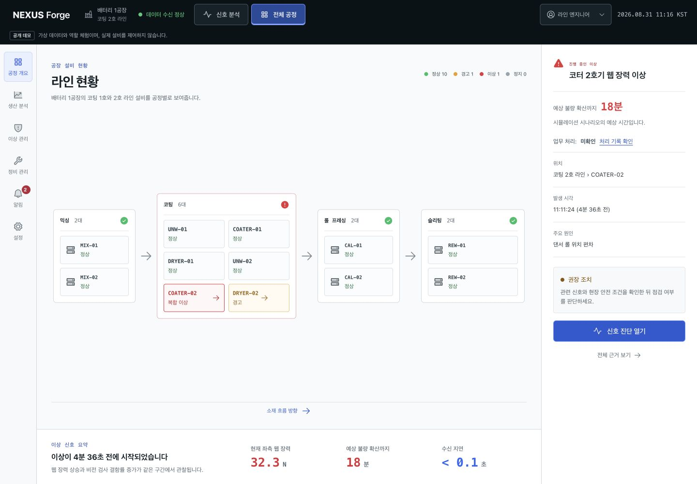
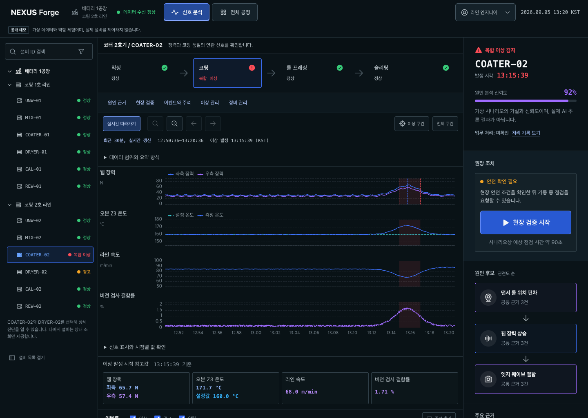
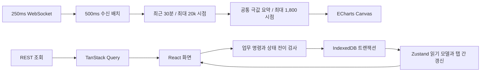

# NEXUS Forge

> 제조 이상 진단과 점검 결과 처리를 구현한 실시간 웹 애플리케이션

배터리 코팅 라인의 이상을 찾고, 센서 신호를 비교해 점검을 요청한 뒤 결과와 이상 종결 사유를 기록합니다. 공정 개요에서 진단, 작업 지시, 후속 처리까지 하나의 흐름으로 연결합니다.

**공개 데모:** 결정론적 합성 데이터를 사용합니다. 실제 설비 제어, AI 추론 결과나 고객사 운영 실적을 제공하지 않습니다.

[공개 데모](https://nexus-forge-ten.vercel.app/overview) | [핵심 화면](#핵심-화면) | [데모 사용 방법](#데모-사용-방법) | [로컬 실행](#로컬-실행) | [문서](#문서)

[](https://github.com/kwakhyun/nexus-forge/actions/workflows/ci.yml)

## 주요 기능

| 화면 | 제공 기능 |
| --- | --- |
| 공정 개요 | 두 코팅 라인의 12대 설비 상태, 공정 흐름과 활성 이상 |
| 신호 진단 | COATER-02와 DRYER-02의 최근 30분 이력, 동기화된 센서 차트, 이벤트와 주석, 키보드로 조작하는 신호 표시와 시점별 값 조회 |
| 생산 분석 | 최근 24시간/7일과 이전 동기간 비교, 라인 필터, 가중 불량률, 그래프와 표, CSV 내보내기 |
| 이상 관리 | 검색과 상태 필터, 이상 확인, 담당자 지정, 연결 작업 조회와 종결 |
| 정비 관리 | 작업 검색, 기한 경과 표시, 점검 시작과 완료, 결과와 인계 내용 기록 |
| 알림 | 이상과 작업 처리 알림, 읽음 상태, 관련 기록 이동 |
| 설정 | 차트 기본 범위, KST/UTC, 알림 설정, 기록 JSON 내보내기와 초기화 |

작업 발행, 점검 완료와 이상 종결은 각각 별도의 상태입니다. 연결된 작업을 모두 완료하고 종결 사유를 남겨야 이상을 닫을 수 있습니다. 사용자가 처리한 건수는 합성 생산 실적과 구분하며, 작업 완료가 센서값이나 수율을 바꾸지는 않습니다.

## 핵심 화면

### 공정 개요

설비를 공정 순서로 배치하고 상태를 색상, 아이콘과 텍스트로 표시합니다. 이상 설비를 선택하면 관련 신호와 권장 조치를 확인할 수 있습니다.



### 신호 진단

같은 시간축에서 장력, 온도, 속도와 검사 결함률을 비교합니다. 이상 발생 시점의 참고값과 원인 후보를 확인하고, 안전 조건을 점검한 뒤 작업을 요청합니다.



화면은 합성 데이터로 실행한 예시입니다. `COATER-02`는 네 개 패널을, `DRYER-02`는 장력 없이 세 개 패널과 165°C 설정값을 표시합니다. 두 설비는 공통 진단 화면을 사용하며 데이터와 작업 결과는 설비별로 구분합니다.

## 데모 사용 방법

1. 공정 개요에서 `COATER-02` 또는 `DRYER-02`를 선택합니다.
2. 센서 차트에서 이상 구간으로 이동하고 신호와 참고값을 비교합니다. `신호 표시와 시점별 값 확인`을 펼치면 체크박스, 슬라이더와 표로 값을 탐색할 수 있습니다.
3. `현장 검증 시작`에서 안전 조건을 확인하고 작업 지시를 발행합니다. 교대 관리자 역할에서는 담당자를 선택할 수 있습니다.
4. 정비 관리에서 점검을 시작하고 결과를 기록해 완료합니다.
5. 연결된 이상에서 잔여 위험과 종결 사유를 확인한 뒤 이상을 종결합니다. 알림에서 관련 기록으로 이동할 수 있습니다.

업무 기록은 같은 브라우저에서 새로고침 후에도 복원됩니다. 설정에서 기록을 내보내고 확인 문구를 입력하면 데모를 초기화할 수 있습니다.

발행 결과를 받지 못한 요청은 기존 요청 ID로 조회합니다. 서버에 결과가 없으면 미확정 상태를 안내하고, 의미를 확인한 뒤 요청 추적을 종료할 수 있습니다. 추적 종료는 작업 취소나 미발행 확인을 뜻하지 않습니다.

## 설계와 구현

- **프론트엔드:** React 19, TypeScript, Vite, TanStack Query, Zustand, ECharts Canvas
- **데이터와 저장:** Node.js REST/WebSocket, 공유 TypeScript 계약, 브라우저 IndexedDB
- **개발 환경:** npm workspaces, Turborepo, Vitest, Testing Library, Playwright, Storybook
- **배포와 오류 관찰:** GitHub Actions, Vercel, 배포 SHA 확인, 선택적 Sentry 로딩

### 상태와 데이터 흐름

TanStack Query는 서버 조회와 캐시를 관리합니다. Zustand는 센서 상태, 업무 기록과 저장 전 입력을 분리합니다. 업무 변경은 IndexedDB 트랜잭션이 완료된 뒤에만 성공으로 표시하며, 같은 브라우저의 여러 탭에서 필드별 충돌을 검사합니다.



센서 구독은 공정 개요와 진단 화면에서 활성화합니다. 숨겨진 탭에서는 수신을 중단하고, 진단 화면 복귀 시 이력을 재조회합니다. 소켓 연결과 센서 신선도를 별도로 감시하며, 근거가 유효하지 않으면 분석과 신규 작업 발행을 보류합니다.

### 시계열 처리

기본 이력은 18,000개 시점이며 API는 최대 100,000개까지 허용합니다. 입력이 20,000개를 넘으면 구간 경계와 센서별 최솟값/최댓값을 보존해 줄입니다. 차트에는 최대 1,800개 공통 시점을 전달하고 ECharts의 센서별 재샘플링은 사용하지 않습니다.

이 요약은 모든 작은 피크의 반복 횟수나 지속 시간을 보존하지 않습니다. 확대는 요약된 시리즈를 확대하며, 이상 발생 시점의 참고값은 보존 버퍼에서 조회합니다. 측정 조건과 세부 결과는 [성능 문서](./docs/PERFORMANCE.md)에서 확인할 수 있습니다.

### 프로젝트 구조

```text
apps/
  web/             화면, 차트, 업무 상태와 브라우저 테스트
  stream-server/   REST API, WebSocket과 합성 데이터
packages/
  contracts/       API와 스트림의 공유 타입
  ui/              디자인 토큰과 공통 컴포넌트
```

제품과 디자인 탐색, 구현, 테스트와 문서 작성에 AI 개발 도구를 활용합니다. 기술 선택의 근거와 검증 범위는 [기술 판단 사례](./docs/ENGINEERING_CASE_STUDIES.md)에 정리합니다.

## 로컬 실행

Node.js 22.x와 npm이 필요합니다.

```bash
npm ci
npm run dev
```

- 웹: `http://127.0.0.1:5173/overview`
- 서버 상태: `http://127.0.0.1:8787/health`
- 컴포넌트 문서: `npm run storybook`

### 검사와 빌드

```bash
npm run lint
npm run typecheck
npm test
npm run build
npm run storybook:build
npm run test:e2e
```

E2E는 웹과 서버를 빌드한 뒤 로컬 production preview에서 실행합니다. 8787 포트의 개발 서버를 먼저 종료하세요. 기본 웹 포트는 4174이며, 충돌하면 `NEXUS_E2E_PORT=4186 npm run test:e2e`로 변경할 수 있습니다. 캐시를 우회한 단위 검사는 `npm test -- --force`로 실행합니다.

## 배포

`main`의 GitHub Actions에서 정적 검사와 Chromium E2E가 모두 성공하면 Vercel 배포를 시작합니다. 재시도 후에만 통과한 E2E도 배포를 차단합니다. 배포 뒤에는 `/api/health`의 SHA, 화면 경로, REST 이력과 WebSocket 수신을 확인합니다.

로컬 Node 서버와 Vercel Functions는 같은 API 및 스트림 런타임을 사용합니다. ChatGPT Sites용 정적 산출물도 생성합니다.

## 운영 범위와 한계

- 실제 장비 프로토콜 연동과 AI 추론 엔진은 없습니다. 두 설비의 합성 시나리오는 실제 라인의 물리적 인과 모델이 아닙니다.
- 업무 기록은 브라우저 IndexedDB에 저장합니다. 기기 간 동기화와 서버 백업은 제공하지 않습니다.
- 서버의 작업 발행 기록은 인스턴스 메모리에 최근 100건만 남습니다. 재시작과 다중 인스턴스에 걸친 영속 멱등성은 보장하지 않습니다.
- 역할 선택은 UX 체험용이며 인증, 서버 권한, 승인과 불변 감사 로그를 대체하지 않습니다.
- 저장 전 입력과 주석은 탭 메모리에 보관하며 새로고침 시 초기화됩니다.
- 장기 센서 보관, 확대 구간의 원본 재조회, 실제 제조 네트워크와 8시간 교대 규모의 검증은 제공 범위에 포함하지 않습니다.
- Sentry는 DSN을 설정한 환경에서만 로드합니다.

## 문서

- [제품 명세](./docs/PRODUCT_SPEC.md)와 [기능별 구현 근거](./docs/REQUIREMENTS_MAPPING.md)
- [아키텍처](./docs/ARCHITECTURE.md)와 [API 계약](./docs/API.md)
- [기술 판단 사례](./docs/ENGINEERING_CASE_STUDIES.md)와 [설계 결정](./docs/DECISIONS.md)
- [설비별 구성과 재사용 범위](./docs/EQUIPMENT_REUSE.md)
- [성능 측정 방법과 결과](./docs/PERFORMANCE.md)
