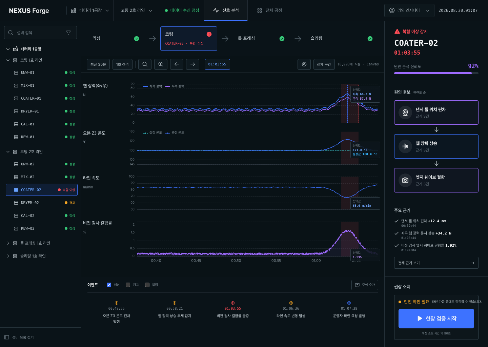
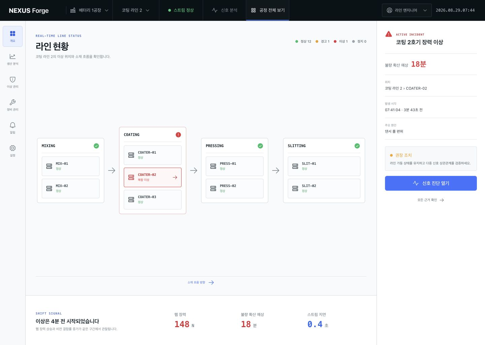
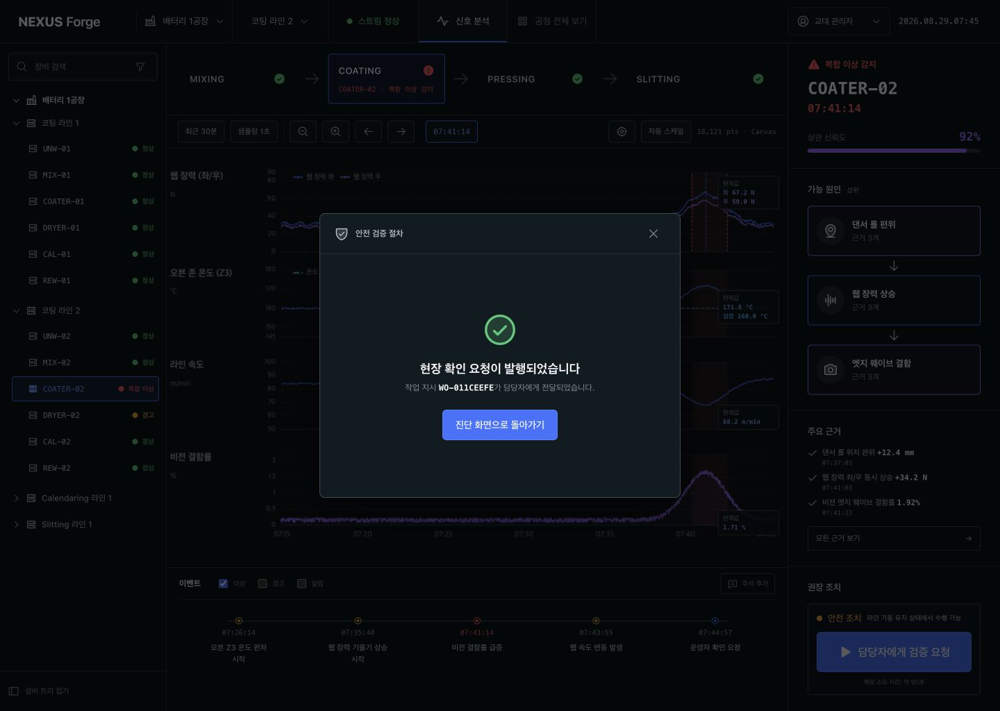
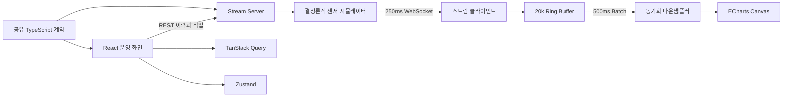

# NEXUS Forge

> 실시간 이상 신호를 현장 조치로 연결하는 배터리 제조 운영 OS 포트폴리오

NEXUS Forge는 배터리 셀 제조 라인의 설비와 센서 데이터를 하나의 공정 맥락으로 묶고, 이상 발생 시 원인 후보를 좁힌 뒤 현장 검증 작업까지 발행하는 웹 애플리케이션입니다.

보기 좋은 KPI 대시보드보다 **“지금 무엇이 잘못되었고, 다음에 무엇을 해야 하는가”**를 빠르게 판단할 수 있는 도구에 초점을 맞췄습니다.



## 프로젝트 개요

| 항목 | 내용 |
| --- | --- |
| 프로젝트 성격 | Enterprise AI 제조 운영 도메인 개인 포트폴리오 |
| 대상 사용자 | 라인 엔지니어, 교대 관리자 |
| 핵심 시나리오 | 공정 이상 발견 → 다중 센서 분석 → 원인 후보 확인 → 현장 검증 작업 발행 |
| 프론트엔드 | React 19, TypeScript, Vite, TanStack Query, Zustand, ECharts |
| 플랫폼 | Node.js, REST, WebSocket, 공유 계약 패키지 |
| 품질 체계 | Vitest, Testing Library, Playwright, Storybook, GitHub Actions, Sentry |
| 데이터 | 실제 기업 정보를 사용하지 않은 결정론적 합성 제조 데이터 |

## 해결하려는 문제

제조 현장에서는 설비별 화면과 시스템별 코드가 분리되어 있어, 이상 알림이 발생해도 여러 화면을 오가며 원인을 조합해야 합니다. 특히 수만 개의 센서 시점이 계속 쌓이는 상황에서는 단일 KPI나 평균값만으로 사건의 전후 관계를 설명하기 어렵습니다.

NEXUS Forge는 다음 세 가지 문제를 하나의 흐름으로 해결합니다.

1. 라인 전체에서 문제가 발생한 설비를 빠르게 찾습니다.
2. 서로 다른 단위의 센서 신호를 동일한 시간축에서 비교합니다.
3. 분석 결과를 읽는 데서 끝내지 않고 검증 가능한 현장 작업으로 전환합니다.

## 핵심 사용자 경험

### 1. 공정 개요에서 이상 설비 발견

12대 설비의 상태와 공정 흐름을 함께 보여줍니다. 상태 집계와 공정별 설비 수는 같은 설비 데이터에서 계산하며, 이상 카드에서 `COATER-02` 진단 화면으로 바로 이동할 수 있습니다.



### 2. 다중 센서 시계열 진단

웹 장력, 오븐 온도, 라인 속도, 비전 검사 결함률을 하나의 시간축에 맞춰 표시합니다. 이상 구간, 이벤트 마커, 선택 시점 값을 함께 제공해 신호 사이의 선후 관계를 읽을 수 있습니다.

- 30분 이력 18,000개 시점 로딩
- 20,000개 고정 용량 링 버퍼
- 변화량 기반 1,800개 대표 시점 선택
- ECharts Canvas 기반 동기화 렌더링
- 확대, 축소, 이동, 전체 구간 맞춤 지원

### 3. 원인 후보에서 현장 조치로 전환

오른쪽 레일은 `댄서 롤 위치 편차 → 웹 장력 상승 → 엣지 웨이브 결함`의 원인 흐름과 근거 신호를 보여줍니다. 작업자는 안전 조건을 확인한 후 검증 작업 지시를 발행하며, 관리자는 담당자를 지정하고 발행 상태와 완료 기한을 확인합니다.



## 프론트엔드 설계 판단

### 서버 상태와 고빈도 스트림 상태 분리

TanStack Query는 설비 요약, 이력, 검증 작업처럼 요청과 캐시 수명주기가 있는 서버 상태를 담당합니다. Zustand는 연결 상태, 선택 시점, 역할, 실시간 링 버퍼처럼 화면 상호작용과 밀접한 상태를 담당합니다. 이 경계 덕분에 서버 캐시 갱신과 고빈도 센서 업데이트가 서로 불필요하게 영향을 주지 않습니다.

### 수신 빈도와 렌더링 빈도 분리

서버는 250ms 간격으로 새 시점을 전송하지만, 클라이언트는 데이터를 500ms 단위로 모아 반영합니다. 매 패킷마다 React 트리를 갱신하지 않아도 원본 스트림은 보존되며, 화면은 초당 두 번의 예측 가능한 주기로 업데이트됩니다.

### 이상값을 보존하는 동기화 다운샘플링

단순 간격 샘플링은 짧은 피크를 누락할 수 있습니다. 이 프로젝트는 여러 센서의 변화량을 함께 계산해 대표 시점을 고르므로, 모든 트랙의 X축이 유지되고 급격한 이상 신호도 보존됩니다.

### 역할별 정보 구조

라인 엔지니어에게는 즉시 실행 가능한 검증 절차를, 교대 관리자에게는 담당자 위임 흐름을 제공합니다. 같은 사고를 보더라도 역할에 따라 다음 행동이 달라지는 제조 현장 특성을 UI에 반영했습니다.

## 아키텍처



```text
apps/
  web/             운영 화면, 시각화, Storybook, 테스트
  stream-server/   REST API, WebSocket, 센서 시뮬레이션
packages/
  contracts/       설비, 센서, 사고, 작업 계약
  ui/              토큰과 공용 UI 컴포넌트
docs/              제품, 아키텍처, 성능, API, 디자인 QA
```

## 운영 품질을 위한 구성

- WebSocket 지수 백오프 재연결과 연결 상태 표시
- 설비 검색과 상태 필터, 이벤트 유형 필터, 작업자 주석
- 모달 포커스 순환과 닫은 뒤 포커스 복귀
- 200% 확대와 좁은 패널을 위한 단계별 반응형 재배치
- API 헬스 체크와 오류 상태 처리
- 진단 라우트 `React.lazy` 분리
- ECharts 전용 비동기 청크 구성
- `VITE_SENTRY_DSN`이 있을 때만 Sentry 동적 로딩
- Storybook 컴포넌트 문서와 접근성 애드온
- GitHub Actions 기반 lint, typecheck, unit, build, Storybook, Chromium E2E
- REST와 WebSocket에서 함께 사용하는 TypeScript 계약 패키지

## 검증 결과

| 검증 | 결과 |
| --- | --- |
| ESLint | 통과, warning 0 |
| TypeScript | 전체 워크스페이스 통과 |
| 단위 및 컴포넌트 테스트 | 13개 통과 |
| Playwright 핵심 사용자 흐름 | Chromium 1440×1024 통과 |
| 프로덕션 빌드 | 통과 |
| Storybook 정적 빌드 | 통과 |
| 의존성 감사 | 취약점 0건 |
| 브라우저 런타임 | 오류 및 경고 0건 |
| 시안 비교 | P0, P1, P2 이슈 없음 |

```bash
npm run lint
npm run typecheck
npm test
npm run build
npm run storybook:build
npm run test:e2e
```

## 로컬 실행

Node.js 22 이상이 필요합니다.

```bash
npm install
npm run dev
```

- 웹 앱: `http://127.0.0.1:5173/overview`
- 진단 화면: `http://127.0.0.1:5173/diagnostics/COATER-02`
- 스트림 서버 상태: `http://127.0.0.1:8787/health`
- Storybook: `npm run storybook`

## 상세 문서

- [제품 명세](./docs/PRODUCT_SPEC.md)
- [아키텍처와 데이터 흐름](./docs/ARCHITECTURE.md)
- [성능 전략](./docs/PERFORMANCE.md)
- [API 계약](./docs/API.md)
- [채용 요건 대응표](./docs/REQUIREMENTS_MAPPING.md)
- [디자인 검수 기록](./docs/design-qa.md)
- [화면 문구 검토 기록](./docs/COPY_AUDIT.md)

## 공개 자료 기반 설계 근거

- [지신 공식 사이트](https://jishin.io/)는 현장 AI 자산을 하나의 인터페이스에서 가시화하고 제어하며, 실행 가능한 인사이트를 제공하는 제품 방향을 설명합니다. 클라우드, 온프레미스, 엣지 배포도 함께 제시합니다.
- [한국산업기술기획평가원 R&D 정보](https://itech.keit.re.kr/ntcinfo/infoSrch/retrieveKeyWrdSrchList.do)는 지신의 과제를 “멀티벤더 레거시 통합을 위한 Ontology 기반 제조 운영 OS(APEX OS) 개발 및 실증”으로 공개합니다.

이 공개 정보를 바탕으로 멀티벤더 설비를 하나의 공정 모델로 표현하고, 가시화에서 현장 조치까지 이어지는 독립적인 제품을 설계했습니다. 공개되지 않은 Apex OS 화면이나 기능을 추정하거나 복제하지 않았으며, 지신 또는 실제 고객사와 제휴하거나 내부 정보를 사용하지 않았습니다.

## 다음 확장 범위

- OPC-UA, MQTT 어댑터와 실제 설비 태그 정규화
- 설비, 센서, 공정, 이상 사건을 연결하는 Ontology 탐색 화면
- 오프라인 구간 재생과 사고 비교 분석
- 권한, 감사 로그, SSO를 포함한 엔터프라이즈 운영 기능
- WebGL 기반 2D/3D 공장 레이아웃과 설비 상태 오버레이
