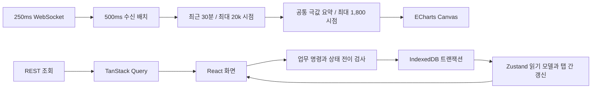

# NEXUS Forge

> 제조 이상 진단과 점검 결과 처리를 구현한 실시간 프론트엔드 공개 데모

배터리 코팅 라인의 이상을 찾고, 센서 신호를 비교해 점검을 요청한 뒤 결과와 이상 종결 사유를 기록하는 웹 애플리케이션입니다. React와 TypeScript로 실시간 시각화, 장애 복구, 업무 상태 전이를 구현했습니다.

**공개 데모:** 결정론적 합성 데이터를 사용합니다. 실제 설비 제어, AI 추론 결과, 고객사 운영 실적을 제공하지 않습니다.

[공개 데모](https://nexus-forge-ten.vercel.app/overview) | [3분 검토 동선](#3분-검토-동선) | [기술 판단 사례](./docs/ENGINEERING_CASE_STUDIES.md) | [설비 재사용](./docs/EQUIPMENT_REUSE.md) | [성능 측정](#실측-성능-비교) | [CI](https://github.com/kwakhyun/nexus-forge/actions/workflows/ci.yml)

[](https://github.com/kwakhyun/nexus-forge/actions/workflows/ci.yml)

검증 상태: 최신 변경의 로컬 자동 검증을 완료했습니다. 최종 직접 화면 검수와 최신 캡처는 미완료입니다. 공개 배포의 커밋 일치는 해당 커밋의 CI `deploy` 작업과 [현재 공개 릴리스](https://nexus-forge-ten.vercel.app/api/health)에서 확인할 수 있습니다. [제출 준비 기록](./docs/SUBMISSION_REVIEW_2026-08-31.md)에서 로컬 검사와 남은 검수 항목을 구분합니다.

## 먼저 볼 네 가지 구현

| 문제 | 구현한 처리 | 확인 근거 |
| --- | --- | --- |
| 차트를 줄이는 과정에서 다른 센서의 피크가 사라짐 | 공통 구간의 경계와 센서별 최솟값/최댓값 시점을 합치고 차트의 추가 샘플링을 비활성화 | [90N 피크 누락의 재현과 수정](./docs/ENGINEERING_CASE_STUDIES.md#사례-1-빠른-차트가-센서-피크를-지우는-문제) |
| 소켓은 연결돼 있지만 센서 데이터가 멈춤 | 센서 신선도와 하트비트를 별도로 감시하고, 근거가 유효하지 않으면 신뢰도와 작업 발행을 보류 | [스트림 처리](./apps/web/src/hooks/useSensorStream.ts), [장애 회귀 검사](./apps/web/e2e/ux-recovery.spec.ts) |
| 다른 설비를 추가하면 진단 화면을 다시 만들어야 함 | COATER-02와 DRYER-02의 패널, 기준값, 안전 조건을 공통 구현에 연결하고 전환 시 데이터와 작업 결과 혼입을 차단 | [실제 두 설비 재사용과 변경 지점](./docs/EQUIPMENT_REUSE.md) |
| 다른 탭의 저장이나 화면 이동 때문에 작성 내용이 사라짐 | IndexedDB 트랜잭션, 필드별 충돌 검사, 탭 전용 초안과 명시적 취소를 분리 | [다중 탭 입력 보존 사례](./docs/ENGINEERING_CASE_STUDIES.md#사례-2-트랜잭션이-있어도-사라지는-작성-중-입력) |

점검 완료와 이상 종결도 별개입니다. 연결된 작업이 모두 끝나고 종결 사유를 남겨야 이상을 닫을 수 있습니다. 점검 버튼을 눌렀다는 이유로 합성 수율이나 생산량을 개선된 값으로 바꾸지 않습니다.

## 3분 검토 동선

1. 공정 개요에서 `COATER-02` 이상을 선택해 진단 화면으로 이동합니다.
2. 원본/표시 시점 수, 동기화된 센서 신호, 이상 발생 시점의 원본 참고값을 확인합니다.
3. `현장 검증 시작`에서 안전 조건을 확인하고 작업 지시를 발행합니다. 교대 관리자로 전환하면 담당자를 선택해 요청할 수 있습니다.
4. 정비 관리에서 작업을 시작하고 결과를 기록해 완료합니다. 연결된 이상으로 이동해 잔여 위험과 종결 사유를 확인합니다.
5. 알림의 관련 기록 이동과 새로고침 후 작업 이력 복원을 확인합니다. 생산 분석의 합성 실적과 사용자가 처리한 건수는 구분돼 있습니다.

재사용을 확인하려면 공정 개요나 진단 설비 목록에서 `DRYER-02`를 선택합니다. 같은 화면이 장력 없이 3개 패널과 165°C 설정값을 표시하며, 외부 계기 점검용 안전 확인으로 작업을 발행합니다. 두 설비를 왕복해도 데이터와 발행 결과는 분리됩니다.

한 번 종결한 데모를 다시 체험하려면 설정에서 기록을 내보낸 후 확인 문구를 입력해 초기화할 수 있습니다. 초기화는 해당 사이트의 브라우저 기록을 지우며, 결과 미확인 발행 요청이 있으면 먼저 요청 결과를 확인해야 합니다.

## 기능 범위

| 화면 | 제공 기능 |
| --- | --- |
| 공정 개요 | 두 코팅 라인의 12대 설비 상태, 공정 흐름과 활성 이상 |
| 신호 진단 | `COATER-02`와 `DRYER-02`의 최근 30분 이력, 설비별 실시간 구독과 패널, 이벤트와 주석, 안전 조건별 작업 발행 |
| 생산 분석 | 최근 24시간/7일과 이전 동기간 비교, 라인 필터, 가중 불량률, 그래프와 표, CSV |
| 이상 관리 | 검색과 상태 필터, 이상 확인, 담당자 지정, 연결 작업과 별도 종결 |
| 정비 관리 | 작업 검색, 기한 경과, 시작과 완료, 점검 결과와 인계 내용 |
| 알림 | 이상과 작업 처리 알림, 읽음 상태, 관련 기록 이동 |
| 설정 | 차트 기본 범위, KST/UTC, 알림 생성, 기록 JSON 내보내기와 확인 후 초기화 |

생산 분석은 완료된 14일의 합성 코팅 길이를 집계합니다. 초기 완료 이력은 `예시 기록`으로 표시하고 사용자 처리 건수에서 제외합니다. [제품 명세](./docs/PRODUCT_SPEC.md)에 상태별 행동과 미지원 범위를 정리했습니다.

## 설계와 구현

- **프론트엔드:** React 19, TypeScript, Vite, TanStack Query, Zustand, ECharts Canvas
- **데이터와 저장:** Node.js REST/WebSocket, 공유 TypeScript 계약, 브라우저 IndexedDB
- **개발 환경:** npm workspaces, Turborepo, Vitest, Testing Library, Playwright, Storybook, GitHub Actions
- **운영 보조:** API 타임아웃과 응답 검증, 오류 경계, 배포 SHA 확인, DSN 설정 시 Sentry 로딩

### 상태 경계

TanStack Query는 공정 요약, 센서 이력과 생산 실적의 조회 및 캐시를 관리합니다. Zustand는 고빈도 센서 상태, 저빈도 업무 상태, 저장 전 입력을 별도 스토어로 관리합니다. 저장된 업무 기록의 기준은 IndexedDB이며 트랜잭션 완료 후에만 성공을 표시합니다.



### 시계열 요약의 보장 범위

초기 이력은 18,000개 시점이며 링 버퍼는 최근 30분, 최대 20,000개 시점을 보관합니다. 차트 입력은 최대 1,800개 공통 시점으로 제한합니다. 각 공통 구간의 양 끝과 다섯 센서별 최솟값/최댓값을 보존하며, 같은 시점은 중복 전달하지 않습니다. ECharts의 센서별 재샘플링은 끕니다.

모든 작은 국소 피크, 반복 횟수와 지속 시간까지 보존하지는 않습니다. 확대는 요약된 시리즈를 확대하는 기능입니다. 이상 발생 시점의 참고값은 별도로 원본에서 찾으며, 해당 시점의 원본이 없으면 분석과 새 작업 발행을 보류합니다.

[아키텍처](./docs/ARCHITECTURE.md) | [API 계약](./docs/API.md) | [대안과 비용을 포함한 결정 기록](./docs/DECISIONS.md)

### 재사용의 실제 범위

두 설비는 같은 진단 페이지, 차트 렌더러, 작업 발행과 후속 상태 전이를 사용합니다. 차트의 표시 신호는 5개에서 3개로 바뀌지만 전송 계약은 기존 다섯 센서 필드를 공유합니다. 임의 태그 스키마나 다른 현장 프로토콜을 설정만으로 지원한 것은 아닙니다. [설비별 구성과 회귀 검사](./docs/EQUIPMENT_REUSE.md)에 이 경계와 필요한 변경을 공개합니다.

## 실측 성능 비교

### 차트 단독 전후 비교

2026년 8월 31일, 실제 앱의 현재 샘플러를 빌드해 합성 차트를 측정했습니다. 아래의 개선율은 이 차트 조건에 한정되며 전체 앱의 개선율이 아닙니다.

| 측정 항목 | 원본/전체 import 기준 | 현재 요약/Core import | 변화 |
| --- | ---: | ---: | ---: |
| ECharts 전용 번들, gzip | 380.2KB | 199.5KB | 47.5% 감소 |
| Canvas 동기 렌더 중앙값 | 33.2ms | 6.3ms | 81.0% 감소 |
| 데이터 준비 + 동기 렌더 중앙값 | 35.4ms | 9.3ms | 73.7% 감소 |
| Canvas 동기 렌더 p95 | 36.3ms | 8.8ms | 60회 표본 기준 |

Apple M2, Chromium 151, 1200×700, DPR 1, 애니메이션 비활성화, 4개 패널과 6개 시리즈 조건입니다. 원본 18,000개 시점과 현재 알고리즘이 선택한 **1,208개 시점**을 비교했습니다. 표시 예산 1,800개와 실제 선택 개수는 구분합니다.

각 조건을 3회 예열한 뒤 60회 측정했으며 원본 표본과 샘플러 소스 해시를 보관합니다. 데이터 준비에는 현재 샘플러와 차트 옵션 생성이 포함됩니다. **네트워크, React 갱신, 화면 합성과 장시간 부하는 제외한 차트 벤치마크**이며 전체 앱의 반응성이나 현장 SLA를 의미하지 않습니다.

```bash
npm run benchmark:performance
```

[차트 전후 비교 원본](./docs/benchmarks/performance-2026-08-31.json) | [측정 방법과 과거 결과](./docs/PERFORMANCE.md)

### 실제 앱의 진단과 작업 발행 흐름

같은 날 실제 프로덕션 빌드와 REST/WebSocket 런타임으로 두 설비를 각각 3회, 30초씩 측정했습니다. Apple M2, Chromium headless, 1440×1024, DPR 1의 로컬 HTTP/WS 조건입니다. 공개 Vercel 사이트의 측정값이나 전체 앱의 전후 개선율은 아닙니다.

| 측정 구간 | 통계 / 설비별 표본 수 | COATER-02 | DRYER-02 |
| --- | --- | ---: | ---: |
| 설비 선택 → 첫 이력 반영 | 중앙값 / 3 | 489.4ms | 463.9ms |
| 배치의 최초 수신 → 차트 반영, 500ms 배치 대기 포함 | p95 / 177 | 523.3ms | 523.9ms |
| 배치의 최신 수신 → 차트 반영 | p95 / 180 | 282.8ms | 282.1ms |
| 배치 상태 반영 → 차트 반영 | p95 / 180 | 49.5ms | 45.2ms |
| 확대 버튼 → 차트 반영 | p95 / 21 | 48.3ms | 48.4ms |
| 작업 발행 → 저장 후 결과 반영 | 중앙값 / 3 | 45.5ms | 45.2ms |

‘반영’은 후속 렌더 프레임 기회까지이며 실제 픽셀 합성 완료 시각은 아닙니다. 초기 진입과 발행은 표본이 적어 p95를 제시하지 않습니다. 차트 수치에는 ECharts의 `finished` 이후 두 번의 rAF 대기도 포함됩니다.

별도 180초 연속 수신에서도 원본 20,000개와 표시 1,800개 상한을 지켰습니다. 전체 7회 실행의 연속 관찰 구간에는 Long Task가 없었지만, 초기 진입에는 7개가 있었고 최댓값은 63ms였습니다. 힙 관측값은 정밀도가 낮은 API에서 동일하게 반환되어 메모리 추이나 누수 여부를 판단할 근거로 삼지 않았습니다.

`npm run benchmark:application`으로 재현할 수 있습니다. [전체 흐름 원본](./docs/benchmarks/application-flow-2026-08-31.json)과 [구간 정의, 범위와 한계](./docs/PERFORMANCE.md)에 개별 표본과 소스 해시를 공개합니다.

## 기여 범위

2026년 8월 30일 시작한 개인 프로젝트입니다. 작성자는 지원 포지션과 개발 범위, 개선 우선순위와 공개 데모 표시 기준을 정하고 실제 화면 결함을 제보하며 재검증을 요청했습니다. GitHub 저장소 생성과 Vercel 연결도 직접 진행했습니다.

제품과 디자인 대안, 구현 코드, 테스트와 문서 작성에 AI 개발 도구를 활용했습니다. 모든 코드를 직접 수작업으로 작성했거나 실제 제조 고객사를 운영한 경험으로 표현하지 않습니다. [기술 판단 사례와 역할 구분](./docs/ENGINEERING_CASE_STUDIES.md)에 재현한 문제, 선택한 대안, 검증과 남은 비용을 기록했습니다.

## 검증 결과

| 검증 | 결과와 범위 |
| --- | --- |
| 단위/컴포넌트 | 2026년 8월 31일 웹 87개, 서버 14개 통과 |
| 정적 검사 | 루트 lint와 TypeScript 검사 통과 |
| 차트 회귀 | 다중 센서 극값, 공통 시점과 표시 예산, 센서별 추가 샘플링 비활성화 검사 통과 |
| 업무 흐름과 레이아웃 | Chromium E2E 53개 통과, 재시도 없음. 두 설비 전환, 미확인 요청 보호, 핵심 상태 전이, 장애 복구, 다중 탭, 반응형과 axe 검사 포함 |
| 빌드와 컴포넌트 문서 | 전체 빌드, Storybook 빌드와 Sites 호환성 검사 4개 통과 |
| 최종 직접 화면 검수 | 최신 전 화면 검수와 캡처 미완료 |
| 공개 버전 | CI `deploy` 작업에서 배포 커밋 일치와 공개 UI 셸, REST, WebSocket을 별도 검사 |

[제출 준비 기록](./docs/SUBMISSION_REVIEW_2026-08-31.md)에 실행 명령, 결과와 남은 검수 항목을 모았습니다. 자동 레이아웃과 axe 검사 통과를 모든 화면의 시각적 완성도나 전체 접근성 준수로 확대하지 않습니다.

## 로컬 실행

Node.js 22.x와 npm을 사용합니다.

```bash
npm ci
npm run dev
```

- 웹: `http://127.0.0.1:5173/overview`
- 서버 상태: `http://127.0.0.1:8787/health`
- 컴포넌트 문서: `npm run storybook`

```bash
npm run lint
npm run typecheck
npm test
npm run build
npm run storybook:build
npm run test:e2e
```

워크스페이스는 `apps/web`, `apps/stream-server`, `packages/contracts`, `packages/ui`로 구성합니다.

## 공개 배포

Vercel의 Git 직접 배포 대신 `main`의 GitHub Actions 검증 성공 후 배포 훅을 호출하도록 구성했습니다. 배포 뒤 `/api/health`의 SHA와 해당 커밋을 대조하고 공개 UI 셸, REST 이력과 WebSocket 수신을 확인합니다. 로컬 실행 성공과 공개 배포 성공은 별도 결과로 기록합니다.

REST와 스트림의 공통 런타임을 로컬 Node 서버와 Vercel Functions에서 공유합니다. ChatGPT Sites 산출물은 보조 호환성 범위로 유지합니다.

## 운영 한계

- 실제 PLC, MES, SCADA, OPC-UA, MQTT 연동이나 AI 추론 엔진이 없습니다. 상세 진단은 `COATER-02`와 `DRYER-02`의 최근 30분만 제공합니다. 두 합성 시나리오는 실제 라인의 물리적 인과 모델이 아닙니다.
- 작업과 이상, 알림, 설정은 같은 출처의 브라우저 IndexedDB에 저장합니다. 같은 브라우저 탭에는 반영하지만 다른 기기에는 동기화하지 않으며 서버 백업이 아닙니다.
- 서버의 발행 응답은 인스턴스 메모리에 최대 100건만 남습니다. 재시작과 다중 인스턴스에 걸친 영속 멱등성, 정확히 한 번 실행을 보장하지 않습니다.
- 저장 전 폼과 주석은 탭 메모리입니다. 주석은 240자/최근 50건으로 제한하며 새로고침 시 사라집니다. 입력 이탈 경고도 브라우저 강제 종료까지 보장하지 않습니다.
- 역할 전환은 UX 데모이며 인증, 서버 권한, 승인과 불변 감사 로그가 없습니다. 작업을 실제 담당자에게 보내거나 설비를 제어하지 않습니다.
- 생산 실적은 합성 코팅 길이입니다. 실제 OEE나 개선 효과가 아니며 예방 정비, 부품 재고와 외부 알림 발송도 지원하지 않습니다.
- 차트 요약은 구간별 극값만 보장합니다. 장기간 센서 보관, 확대 시 원본 재샘플링, 실제 제조 부하와 네트워크 검증은 남아 있습니다.
- Sentry는 DSN이 설정된 환경에서만 로드합니다. 공개 데모에 상시 운영 모니터링이 구성됐다는 뜻은 아닙니다.

서버 재시작 시각, 저장 한도와 출처별 데이터 수명은 [아키텍처](./docs/ARCHITECTURE.md), API 응답 범위는 [API 계약](./docs/API.md)에 상세히 정리했습니다.

## 문서와 화면 기록

- [기술 판단 사례](./docs/ENGINEERING_CASE_STUDIES.md), [두 설비 재사용](./docs/EQUIPMENT_REUSE.md), [결정 기록](./docs/DECISIONS.md), [채용 요건 대응표](./docs/REQUIREMENTS_MAPPING.md)
- [제품 명세](./docs/PRODUCT_SPEC.md), [아키텍처](./docs/ARCHITECTURE.md), [성능 측정](./docs/PERFORMANCE.md)
- [제출 준비와 최신 검증](./docs/SUBMISSION_REVIEW_2026-08-31.md)
- 이전 검토: [진단 UI](./docs/UI_UX_REVIEW_2026-08-31.md), [다섯 메뉴 구현](./docs/OPERATIONS_MODULES_2026-08-31.md), [운영 화면 재검토](./docs/OPERATIONS_UI_UX_REVIEW_2026-08-31.md), [문구](./docs/COPY_AUDIT.md)
- 초기 화면: [공정 개요](./docs/design/implementation-overview-final.png), [진단](./docs/design/implementation-diagnostic-final.png), [작업 발행](./docs/design/implementation-verification-success.png), [당시 디자인 검수](./docs/design-qa.md)

초기 화면 이미지는 과거 구현 기록이며 현재 제출 후보의 최종 캡처가 아닙니다. 최신 캡처를 확인하기 전에는 대표 화면으로 교체하지 않습니다.

## 설계 배경과 다음 검증

[지신 공식 사이트](https://jishin.io/)와 [공개 R&D 정보](https://itech.keit.re.kr/ntcinfo/infoSrch/retrieveKeyWrdSrchList.do), 공개 채용 공고를 참고해 독립적인 제조 운영 데모를 설계했습니다. Apex OS의 비공개 화면을 복제하거나 지신 및 고객사의 내부 정보를 사용하지 않았습니다.

두 번째 설비 재사용과 실제 앱의 전체 흐름 계측을 보강했습니다. 다음 검증은 현장 네트워크와 저사양 단말, 다중 사용자 및 장시간 부하입니다. 실제 커넥터, Ontology 탐색, 인증과 2D/3D 공장 시각화는 미구현 확장 범위입니다.

작성자: [kwakhyun](https://github.com/kwakhyun)
