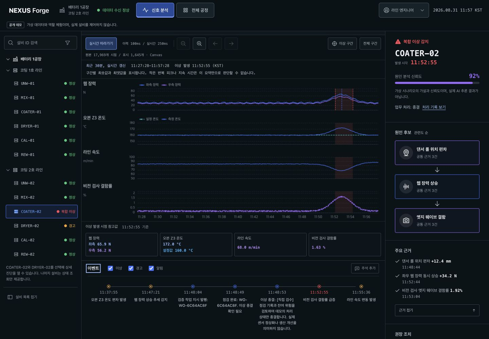
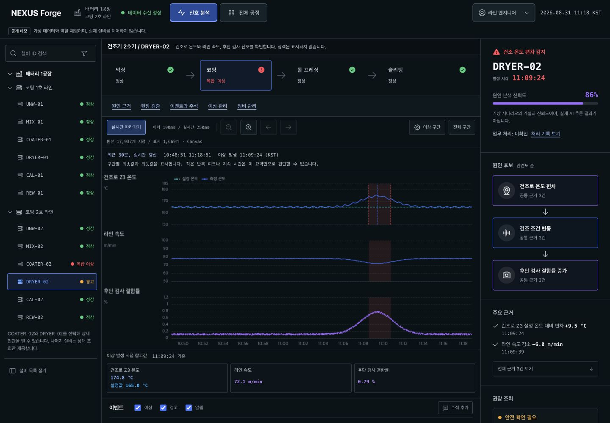
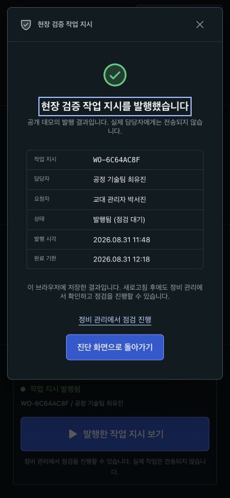
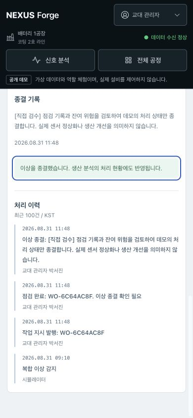
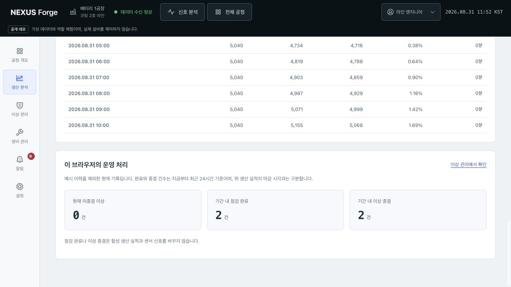
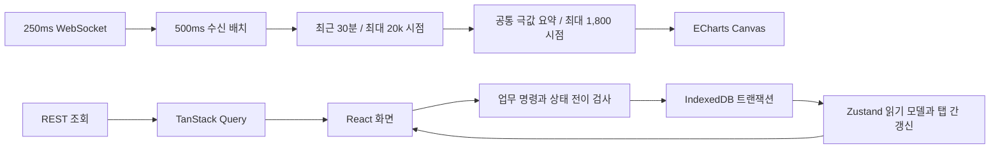

# NEXUS Forge

> 제조 이상 진단과 점검 결과 처리를 구현한 실시간 프론트엔드 공개 데모

**개발: 곽현**

배터리 코팅 라인의 이상을 찾고, 센서 신호를 비교해 점검을 요청한 뒤 결과와 이상 종결 사유를 기록하는 웹 애플리케이션입니다. React와 TypeScript로 실시간 시각화, 장애 복구, 업무 상태 전이를 구현했습니다.

**공개 데모:** 결정론적 합성 데이터를 사용합니다. 실제 설비 제어, AI 추론 결과, 고객사 운영 실적을 제공하지 않습니다.

[공개 데모](https://nexus-forge-ten.vercel.app/overview) | [핵심 화면](#핵심-화면) | [3분 검토 동선](#3분-검토-동선) | [기술 판단 사례](./docs/ENGINEERING_CASE_STUDIES.md) | [설비 재사용](./docs/EQUIPMENT_REUSE.md) | [성능 측정](#실측-성능-비교) | [CI](https://github.com/kwakhyun/nexus-forge/actions/workflows/ci.yml)

[](https://github.com/kwakhyun/nexus-forge/actions/workflows/ci.yml)

**9월 5일 개선:** 이력 만료 후 미확인 발행 요청 복구, 5분/15분 차트 축소와 진단 설비 복귀를 수정했습니다. 차트 키보드 조작과 모바일 정보 배치를 개선하고, 불필요한 센서 구독과 차트 전체 갱신을 줄였습니다. 업무 도메인, 상세 화면과 스타일도 기능별로 분리했습니다. [개선 내역과 현재 소스 검증](./docs/IMPROVEMENTS_2026-09-05.md)을 확인할 수 있습니다.

이전 공개 검증: 8월 31일 일곱 화면과 두 설비의 핵심 업무 흐름을 대표 화면 크기에서 확인하고 다섯 가지 결함을 수정했습니다. 후속 Playwright에서 모바일 16조건과 일반 키보드 조작을 확인했으며, GitHub CI의 단위 검사와 E2E 58개를 통과한 뒤 Vercel 자동 배포와 커밋 일치까지 확인했습니다. [최종 검증 기록](./docs/FINAL_VERIFICATION_2026-08-31.md)에 수정 전후 화면, 실행 결과와 한계를 공개합니다.

성능 보강: 9월 1일에는 10만 개 시점 수신, Chromium CPU 4배 제한, 60분 실시간 수신을 결합해 별도 로컬 프로덕션 빌드로 검증했습니다. 공개 Vercel의 RUM이나 물리 저사양 단말 결과는 아닙니다.

## 먼저 볼 네 가지 구현

| 문제 | 해결 방식 | 확인 근거 |
| --- | --- | --- |
| 차트를 줄이는 과정에서 다른 센서의 피크가 사라짐 | 공통 구간의 경계와 센서별 최솟값/최댓값 시점을 합치고 차트의 추가 샘플링을 비활성화 | [90N 피크 누락의 재현과 수정](./docs/ENGINEERING_CASE_STUDIES.md#사례-1-빠른-차트가-센서-피크를-지우는-문제) |
| 소켓은 연결돼 있지만 센서 데이터가 멈춤 | 센서 신선도와 하트비트를 별도로 감시하고, 근거가 유효하지 않으면 신뢰도와 작업 지시 발행을 보류 | [스트림 처리](./apps/web/src/hooks/useSensorStream.ts), [장애 회귀 검사](./apps/web/e2e/ux-recovery.spec.ts) |
| 다른 설비를 추가하면 진단 화면을 다시 만들어야 함 | COATER-02와 DRYER-02의 패널, 기준값, 안전 조건을 공통 구현에 연결하고 전환 시 데이터와 작업 결과 혼입을 차단 | [실제 두 설비 재사용과 변경 지점](./docs/EQUIPMENT_REUSE.md) |
| 다른 탭의 저장이나 화면 이동 때문에 작성 내용이 사라짐 | IndexedDB 트랜잭션, 필드별 충돌 검사, 탭 전용 초안과 명시적 취소를 분리 | [다중 탭 입력 보존 사례](./docs/ENGINEERING_CASE_STUDIES.md#사례-2-트랜잭션이-있어도-사라지는-작성-중-입력) |

점검 완료와 이상 종결도 별개입니다. 연결된 작업이 모두 끝나고 종결 사유를 남겨야 이상을 닫을 수 있습니다. 점검 버튼을 눌렀다는 이유로 합성 수율이나 생산량을 개선된 값으로 바꾸지 않습니다.

## 3분 검토 동선

1. 공정 개요에서 `COATER-02` 이상을 선택해 진단 화면으로 이동합니다.
2. 보존/표시 시점 수, 동기화된 센서 신호와 이상 발생 시점의 참고값을 확인합니다.
3. `현장 검증 시작`에서 안전 조건을 확인하고 작업 지시를 발행합니다. 교대 관리자로 전환하면 담당자를 선택해 발행을 요청할 수 있습니다.
4. 정비 관리에서 작업을 시작하고 결과를 기록해 완료합니다. 연결된 이상으로 이동해 잔여 위험과 종결 사유를 확인합니다.
5. 알림의 관련 기록 이동과 새로고침 후 작업 이력 복원을 확인합니다. 생산 분석의 합성 실적과 사용자가 처리한 건수는 구분돼 있습니다.

재사용을 확인하려면 공정 개요나 진단 설비 목록에서 `DRYER-02`를 선택합니다. 같은 화면이 장력 없이 3개 패널과 165°C 설정값을 표시하며, 외부 계기 점검용 안전 확인을 거쳐 작업 지시를 발행합니다. 두 설비를 왕복해도 데이터와 작업 지시 발행 결과는 분리됩니다.

한 번 종결한 데모를 다시 체험하려면 설정에서 기록을 내보낸 후 확인 문구를 입력해 초기화할 수 있습니다. 초기화는 해당 사이트의 브라우저 기록을 지웁니다. 미확인 작업 지시가 있으면 먼저 결과를 조회합니다. 서버에서 결과를 찾지 못할 때는 미확정임을 확인하고 요청 추적을 종료할 수 있으며, 작업 취소를 의미하지 않습니다.

## 핵심 화면

2026년 8월 31일 검수 중 저장한 실제 실행 화면입니다. 공정 개요와 건조기 진단은 당시 공개 배포본(`20ad702`), 나머지는 수정 후 로컬 실행본에서 캡처했습니다. 화면의 센서값과 생산 실적은 합성 데이터이며, 작업 기록은 데모에서 입력한 내용입니다. [캡처 시점과 환경](./docs/design/review-2026-08-31/manifest.json)을 함께 보관합니다.

### 공정 개요 — 이상 설비에서 진단으로

두 라인의 12대 설비를 공정 순서로 보여주고, 선택한 이상의 위치와 권장 조치를 진단 화면으로 연결합니다.


### 신호 진단 — 같은 시간축에서 센서와 근거 비교

`COATER-02`의 장력, 온도, 속도와 검사 결함률을 비교합니다. 요약 차트 아래에는 이상 발생 시점의 참고값과 이벤트를 표시하고, 우측에는 합성 시나리오의 원인 후보와 근거를 제시합니다.



<details>
<summary>두 번째 설비 재사용 화면 — DRYER-02</summary>

같은 진단 구조에서 장력 패널을 제외하고 온도, 속도와 후단 검사 신호를 표시합니다. 건조기의 설정값은 165°C이며, 코터와 별도의 진단 근거를 사용합니다.



</details>

### 작업 지시 발행과 이상 종결 — 모바일 후속 처리

첫 화면은 작업 번호, 담당자와 기한을 확인하는 작업 지시 발행 결과입니다. 두 번째 화면은 같은 작업의 점검 완료 후 별도로 이상을 종결한 기록입니다. 작업 지시 발행, 점검 완료와 이상 종결을 구분하며 실제 담당자에게 전송하거나 설비를 제어하지 않습니다.

<p>
  <a href="./docs/design/review-2026-08-31/40-coater-issued-mobile.jpg"></a>
  <a href="./docs/design/review-2026-08-31/43-coater-resolved-mobile.jpg"></a>
</p>

<details>
<summary>생산 분석에서 후속 처리 집계 확인</summary>

두 설비의 점검 완료와 이상 종결이 각각 2건으로 집계된 화면입니다. 브라우저에 저장한 처리 건수는 합성 생산 실적과 구분하며, 작업을 완료해도 합성 수율이나 센서값을 개선된 값으로 바꾸지 않습니다.



</details>

## 기능 범위

| 화면 | 제공 기능 |
| --- | --- |
| 공정 개요 | 두 코팅 라인의 12대 설비 상태, 공정 흐름과 활성 이상 |
| 신호 진단 | `COATER-02`와 `DRYER-02`의 최근 30분 이력, 설비별 실시간 구독과 패널, 이벤트와 주석, 안전 조건별 작업 지시 발행 |
| 생산 분석 | 최근 24시간/7일과 이전 동기간 비교, 라인 필터, 가중 불량률, 그래프와 표, CSV |
| 이상 관리 | 검색과 상태 필터, 이상 확인, 담당자 지정, 연결 작업과 별도 종결 |
| 정비 관리 | 작업 검색, 기한 경과, 시작과 완료, 점검 결과와 인계 내용 |
| 알림 | 이상과 작업 처리 알림, 읽음 상태, 관련 기록 이동 |
| 설정 | 차트 기본 범위, KST/UTC, 알림 생성, 기록 JSON 내보내기와 확인 후 초기화 |

생산 분석은 완료된 14일의 합성 코팅 길이를 집계합니다. 초기 완료 이력은 `예시 기록`으로 표시하고 사용자 처리 건수에서 제외합니다. [제품 명세](./docs/PRODUCT_SPEC.md)에 상태별 행동과 미지원 범위를 정리했습니다.

## 설계와 구현

- **프론트엔드:** React 19, TypeScript, Vite, TanStack Query, Zustand, ECharts Canvas
- **데이터와 저장:** Node.js REST/WebSocket, 공유 TypeScript 계약, 브라우저 IndexedDB
- **개발 환경:** npm workspaces, Turborepo, Vitest, Testing Library, Playwright, Storybook, GitHub Actions
- **운영 보조:** API 타임아웃과 응답 검증, 오류 경계, 배포 SHA 확인, DSN 설정 시 Sentry 로딩

### 상태 경계

TanStack Query는 공정 요약, 센서 이력과 생산 실적의 조회 및 캐시를 관리합니다. Zustand는 고빈도 센서 상태, 저빈도 업무 상태, 저장 전 입력을 별도 스토어로 관리합니다. 저장된 업무 기록의 기준은 IndexedDB이며 트랜잭션 완료 후에만 성공을 표시합니다.



### 시계열 요약의 보장 범위

공개 데모의 기본 이력은 18,000개 시점입니다. API는 성능 검증에서 최대 100,000개 시점을 허용하며, 입력이 20,000개를 넘으면 전체 30분 구간의 경계와 다섯 센서별 최솟값/최댓값을 먼저 보존해 최대 20,000개로 줄입니다. 차트 입력은 같은 방식으로 최대 1,800개 공통 시점으로 제한하고 ECharts의 센서별 재샘플링은 끕니다.

모든 작은 국소 피크, 반복 횟수와 지속 시간까지 보존하지는 않습니다. 확대는 요약된 시리즈를 확대하는 기능입니다. 이상 발생 시점의 참고값은 보존 버퍼에서 찾습니다. 기본 18,000개 이력은 축소하지 않지만, 고밀도 입력에서는 극값 보존 요약을 거친 값입니다. 해당 시점의 근거가 없으면 분석과 새 작업 지시 발행을 보류합니다.

[아키텍처](./docs/ARCHITECTURE.md) | [API 계약](./docs/API.md) | [대안과 비용을 포함한 결정 기록](./docs/DECISIONS.md)

### 재사용의 실제 범위

두 설비는 공통 진단 페이지와 차트 렌더러를 사용하고, 작업 지시 발행과 후속 상태 전이 로직을 공유합니다. 차트의 표시 신호는 5개에서 3개로 바뀌지만 전송 계약은 기존 다섯 센서 필드를 공유합니다. 임의 태그 스키마나 다른 현장 프로토콜을 설정만으로 지원한 것은 아닙니다. [설비별 구성과 회귀 검사](./docs/EQUIPMENT_REUSE.md)에 이 경계와 필요한 변경을 공개합니다.

## 실측 성능 비교

아래는 9월 1일 소스의 기록입니다. 9월 5일 부분 갱신과 구독 중단 변경의 개선율을 뜻하지 않습니다. 이번 확인 범위는 [성능 문서](./docs/PERFORMANCE.md)에 따로 기록합니다.

### 10만 개 시점 차트 전후 비교

2026년 9월 1일, 당시 앱의 샘플러를 빌드해 10만 개 합성 시점의 차트를 측정했습니다. 아래 개선율은 같은 실행 안의 차트 조건 비교이며 전체 앱의 개선율이 아닙니다.

| 측정 항목 | 원본/전체 import 기준 | 현재 요약/Core import | 변화 |
| --- | ---: | ---: | ---: |
| ECharts 전용 번들, gzip | 380.2KB | 199.5KB | 47.5% 감소 |
| Canvas 동기 렌더 중앙값 | 724.2ms | 32.7ms | 95.5% 감소 |
| Canvas 동기 렌더 p95 | 783.2ms | 36.9ms | 각 20회 표본 |
| 데이터 준비 + 동기 렌더 중앙값 | 777.1ms | 98.8ms | 87.3% 감소 |
| 데이터 준비 + 동기 렌더 p95 | 901.3ms | 111.7ms | 각 20회 표본 |

Apple M2, Chromium 151, 1200×700, DPR 1, 애니메이션 비활성화, 4개 패널과 6개 시리즈 조건입니다. CDP로 CPU 실행을 4배 느리게 제한했고 원본 100,000개 시점과 현재 알고리즘이 선택한 **1,732개 시점**을 비교했습니다. 이는 물리 저사양 단말의 실측값이 아닙니다.

각 조건을 2회 예열한 뒤 20회 측정했습니다. 최적화 조건의 데이터 준비에는 샘플링과 차트 옵션 생성이 포함되며, 샘플링만의 중앙값은 62.1ms입니다. **네트워크, React 갱신, 화면 합성과 장시간 부하는 제외한 차트 벤치마크**입니다.

```bash
npm run benchmark:performance
npm run benchmark:chart:stress
```

[10만 시점 차트 원본](./docs/benchmarks/performance-stress-2026-09-01.json) | [일반 조건 원본](./docs/benchmarks/performance-2026-08-31.json) | [측정 방법과 과거 결과](./docs/PERFORMANCE.md)

### 실제 앱의 진단과 작업 지시 발행 흐름

9월 1일 실제 프로덕션 빌드와 REST/WebSocket 런타임으로 10만 개 시점 응답을 사용했습니다. 두 설비를 각각 3회, 30초씩 실행한 뒤 COATER-02를 60분 연속 관찰했습니다. Apple M2, Chromium headless, 1440×1024, DPR 1, CPU 4배 제한, 로컬 HTTP/WS 조건이며 네트워크 제한은 없습니다.

| 측정 구간 | 통계 / 설비별 표본 수 | COATER-02 | DRYER-02 |
| --- | --- | ---: | ---: |
| 설비 선택 → 첫 이력 반영 | 중앙값 [범위] / 3 | 1,201.5ms [1,093.2–1,445.3] | 1,286.2ms [1,257.9–1,301.3] |
| 이력 요청 → 파싱·검증 완료 | 중앙값 [범위] / 3 | 614.7ms [517.5–778.1] | 405.9ms [392.8–412.0] |
| 이력 요청 → 첫 이력 반영 | 중앙값 [범위] / 3 | 844.0ms [721.9–1,050.7] | 896.4ms [868.4–927.0] |
| 배치의 최신 수신 → 차트 반영 | p95 / 180 | 308.7ms | 305.6ms |
| 배치 상태 반영 → 차트 반영 | p95 / 180 | 90.6ms | 76.9ms |
| 작업 지시 발행 → 저장 후 결과 반영 | 중앙값 / 3 | 179.5ms | 122.9ms |

‘반영’은 후속 렌더 프레임 기회까지이며 실제 픽셀 합성 완료 시각은 아닙니다. 초기 진입과 작업 지시 발행은 표본이 적어 p95를 제시하지 않습니다. 차트 수치에는 ECharts의 `finished` 이후 두 번의 rAF 대기도 포함됩니다.

별도 60분 실행은 실시간 최신 수신→차트 반영 7,200개 표본에서 p95 303.8ms, 상태 반영→차트 반영 p95 79.2ms였습니다. 시작·종료 관측을 포함한 720개 관측값(정기 체크포인트 718개)에서 보존 시점은 7,179–18,106개, 표시 시점은 1,574–1,776개로 두 상한을 지켰습니다. 차트 조작 37회가 반영됐고 이상 시점이 30분 범위를 벗어난 뒤의 포커스 7회와 최종 작업 발행은 의도대로 보류됐습니다.

관찰 구간 Long Task는 29건, 최댓값 276ms, 50ms 초과 누적 차단은 916ms였습니다. CDP 강제 GC 뒤 사용 힙은 시작 22.3MB에서 종료 28.9MB로 6.6MB 증가했습니다. 제한된 1시간 실행의 값이며 누수 부재를 증명하지 않습니다. 약 19.9MB의 10만 개 시점 이력 응답은 최초와 추가 재조회에서 총 두 번 처리됐습니다. 두 번째 응답을 일으킨 온라인 상태 이벤트는 분리 계측하지 않아 네트워크 재연결로 확정하지 않습니다. 페이지·콘솔 오류, HTTP 오류, 실패 요청과 버린 계측값은 0건이었습니다.

`npm run benchmark:stress`로 재현할 수 있습니다. [10만 시점, 60분 원본](./docs/benchmarks/application-stress-2026-09-01.json), [일반 조건 원본](./docs/benchmarks/application-flow-2026-08-31.json)과 [구간 정의, 범위와 한계](./docs/PERFORMANCE.md)에 개별 표본과 소스 해시를 공개합니다.

## 개발과 검증

2026년 8월 30일 시작한 개인 프로젝트입니다. 작성자는 제품 범위, 개선 우선순위, 공개 데모 표시 기준을 정했습니다. 실제 화면에서 발견한 결함의 재현 조건과 완료 기준을 기록하고, 수정 후 테스트와 배포 결과를 확인했습니다. GitHub 저장소 생성과 Vercel 연결도 직접 진행했습니다.

제품 방향과 디자인 대안을 탐색하고 구현, 테스트, 문서를 작성하는 과정에서 AI 개발 도구를 활용했습니다. 작성자는 요구사항 충족 여부, 검증 결과와 공개 범위를 최종 확인했습니다. [기술 판단 사례와 역할 구분](./docs/ENGINEERING_CASE_STUDIES.md)에 재현한 문제, 선택한 대안, 검증과 남은 비용을 기록했습니다.

## 검증 결과

| 검증 | 결과와 범위 |
| --- | --- |
| 현재 소스 로컬 | 9월 5일 웹 120개와 서버 18개 검사 확인, Chromium E2E 61개 최종 통과. lint, TypeScript, 전체/Storybook 빌드와 Sites 검사 통과. [실행별 결과](./docs/IMPROVEMENTS_2026-09-05.md) |
| 자동 배포 게이트 | `main`의 quality와 E2E가 모두 성공해야 Vercel 배포를 시작하고, 배포 뒤 `/api/health`의 SHA를 해당 커밋과 대조 |
| 8월 31일 공개 검증 기록 | 기준 커밋 `5474706`의 GitHub CI에서 웹 101개, 서버 14개와 Chromium E2E 58개 통과 |
| 차트 회귀 | 다중 센서 극값, 공통 시점과 표시 예산, 센서별 추가 샘플링 비활성화 검사 통과 |
| 이전 업무 흐름과 레이아웃 | 개선 전 로컬 Chromium E2E 58개 통과. 실패/생략/재시도 0개. 최초 CI의 재시도 문제와 수정 근거도 보관 |
| 빌드와 컴포넌트 문서 | 전체 빌드, Storybook 빌드와 Sites 호환성 검사 4개 통과 |
| 직접 화면 확인 | 일곱 화면, 대표 데스크톱/모바일의 하단과 오류 복구, 두 설비의 작업 지시 발행 → 점검 완료 → 이상 종결 → 새로고침 복원 확인. 캡처 44장 보관 |
| 후속 모바일/키보드 | 8개 경로 × 두 모바일 크기의 16조건 통과. 현재 메뉴 노출, 실제 Tab/Shift+Tab, Enter와 방향키 스크롤 확인. 새 캡처 6장 보관 |
| 공개 상태 확인 | [최신 CI와 자동 배포](https://github.com/kwakhyun/nexus-forge/actions/workflows/ci.yml), [공개 상태 API](https://nexus-forge-ten.vercel.app/api/health)에서 현재 배포 SHA 확인. `5474706`의 8월 31일 결과는 [당시 검증 기록](./docs/FINAL_VERIFICATION_2026-08-31.md)에 보존 |

[최종 검증 기록](./docs/FINAL_VERIFICATION_2026-08-31.md)에 후속 결과를, [릴리스 검증 기록](./docs/RELEASE_REVIEW_2026-08-31.md)에 이전 버전별 검사 결과를, [직접 검수 기록](./docs/BROWSER_REVIEW_2026-08-31.md)에 화면별 행동과 당시 제한을 모았습니다. 자동 검사나 대표 화면의 확인을 모든 크기의 시각적 완성도와 전체 접근성 준수로 확대하지 않습니다.

## 로컬 실행

Node.js 22.x와 npm을 사용합니다.

```bash
npm ci
npm run dev
```

- 웹: `http://127.0.0.1:5173/overview`
- 서버 상태: `http://127.0.0.1:8787/health`
- 컴포넌트 문서: `npm run storybook`

```bash
npm run lint
npm run typecheck
npm test
npm run build
npm run storybook:build
npm run test:e2e
```

E2E는 웹과 서버를 빌드한 뒤 로컬 production preview에서 실행합니다. 8787의 개발 서버를 먼저 종료하고 실행하세요. 기본 웹 포트는 4174이며 충돌하면 `NEXUS_E2E_PORT=4186 npm run test:e2e`처럼 변경할 수 있습니다. 캐시를 우회한 단위 검사는 `npm test -- --force`로 실행합니다.

워크스페이스는 `apps/web`, `apps/stream-server`, `packages/contracts`, `packages/ui`로 구성합니다.

## 공개 배포

Vercel의 Git 직접 배포 대신 `main`의 GitHub Actions 검증 성공 후 배포 훅을 호출하도록 구성했습니다. E2E가 재시도 후에만 통과한 경우도 배포를 차단합니다. 배포 뒤 `/api/health`의 SHA와 해당 커밋을 대조하고 8개 UI 경로의 셸, 두 생산 라인, 두 설비 각각의 REST 이력과 WebSocket 수신을 확인합니다. 로컬 실행 성공과 공개 배포 성공은 별도 결과로 기록합니다.

REST와 스트림의 공통 런타임을 로컬 Node 서버와 Vercel Functions에서 공유합니다. ChatGPT Sites 산출물은 보조 호환성 범위로 유지합니다.

## 운영 한계

- 실제 PLC, MES, SCADA, OPC-UA, MQTT 연동이나 AI 추론 엔진이 없습니다. 상세 진단은 `COATER-02`와 `DRYER-02`의 최근 30분만 제공합니다. 두 합성 시나리오는 실제 라인의 물리적 인과 모델이 아닙니다.
- 작업과 이상, 알림, 설정은 같은 출처의 브라우저 IndexedDB에 저장합니다. 같은 브라우저 탭에는 반영하지만 다른 기기에는 동기화하지 않으며 서버 백업이 아닙니다.
- 서버가 반환한 작업 지시 발행 결과는 인스턴스 메모리에 최대 100건만 남습니다. 재시작과 다중 인스턴스에 걸친 영속 멱등성, 정확히 한 번 실행을 보장하지 않습니다.
- 저장 전 폼과 주석은 탭 메모리입니다. 주석은 240자/최근 50건으로 제한하며 새로고침 시 사라집니다. 입력 이탈 경고도 브라우저 강제 종료까지 보장하지 않습니다.
- 역할 전환은 UX 데모이며 인증, 서버 권한, 승인과 불변 감사 로그가 없습니다. 작업을 실제 담당자에게 보내거나 설비를 제어하지 않습니다.
- 생산 실적은 합성 코팅 길이입니다. 실제 OEE나 개선 효과가 아니며 예방 정비, 부품 재고와 외부 알림 발송도 지원하지 않습니다.
- 차트 요약은 구간별 극값만 보장합니다. 장기간 센서 보관, 확대 시 원본 재샘플링, 물리 저사양 단말과 실제 제조 네트워크, 8시간 교대 규모의 검증은 남아 있습니다.
- Sentry는 DSN이 설정된 환경에서만 로드합니다. 공개 데모에 상시 운영 모니터링이 구성됐다는 뜻은 아닙니다.

서버 재시작 시각, 저장 한도와 출처별 데이터 수명은 [아키텍처](./docs/ARCHITECTURE.md), API 응답 범위는 [API 계약](./docs/API.md)에 상세히 정리했습니다.

## 문서와 화면 기록

- [기술 판단 사례](./docs/ENGINEERING_CASE_STUDIES.md), [두 설비 재사용](./docs/EQUIPMENT_REUSE.md), [결정 기록](./docs/DECISIONS.md), [기능과 구현 근거](./docs/REQUIREMENTS_MAPPING.md)
- [제품 명세](./docs/PRODUCT_SPEC.md), [아키텍처](./docs/ARCHITECTURE.md), [성능 측정](./docs/PERFORMANCE.md)
- [최종 검증과 공개 반영](./docs/FINAL_VERIFICATION_2026-08-31.md), [릴리스 준비와 이전 검증](./docs/RELEASE_REVIEW_2026-08-31.md)
- [8월 31일 전 화면 직접 검수](./docs/BROWSER_REVIEW_2026-08-31.md), [캡처와 출처 목록](./docs/design/review-2026-08-31/manifest.json)
- 이전 검토: [진단 UI](./docs/UI_UX_REVIEW_2026-08-31.md), [다섯 메뉴 구현](./docs/OPERATIONS_MODULES_2026-08-31.md), [운영 화면 재검토](./docs/OPERATIONS_UI_UX_REVIEW_2026-08-31.md), [문구](./docs/COPY_AUDIT.md)
- 초기 화면: [공정 개요](./docs/design/implementation-overview-final.png), [진단](./docs/design/implementation-diagnostic-final.png), [작업 지시 발행](./docs/design/implementation-verification-success.png), [당시 디자인 검수](./docs/design-qa.md)

초기 이미지는 과거 구현 기록으로 유지합니다. 최신 검수 캡처는 별도 폴더에 보관하고 공개 버전과 수정 후 로컬 화면, 수정 전 결함을 구분했습니다. [공정 개요](./docs/design/review-2026-08-31/01-overview-desktop.jpg), [진단과 참고값](./docs/design/review-2026-08-31/64-coater-reference-cards-recovered.jpg), [작업 지시 발행 결과](./docs/design/review-2026-08-31/40-coater-issued-mobile.jpg), [두 설비의 완료 집계](./docs/design/review-2026-08-31/51-production-both-assets-completed.jpg)를 확인할 수 있습니다.

## 설계 배경과 다음 검증

[공개 산업 R&D 정보](https://itech.keit.re.kr/ntcinfo/infoSrch/retrieveKeyWrdSrchList.do)와 제조 운영 소프트웨어 관련 공개 자료를 참고해 독립적인 제조 운영 데모를 설계했습니다. 특정 상용 제품의 비공개 화면을 복제하지 않았으며, 기업이나 고객사의 내부 정보도 사용하지 않았습니다.

두 번째 설비 재사용, 10만 개 시점 이력과 60분 전체 흐름 계측을 보강했습니다. 다음 검증은 현장 네트워크와 물리 저사양 단말, 다중 사용자, 8시간 교대 규모의 부하입니다. 실제 커넥터, Ontology 탐색, 인증과 2D/3D 공장 시각화는 미구현 확장 범위입니다.

작성자: 곽현, Frontend Engineer ([GitHub: kwakhyun](https://github.com/kwakhyun))
