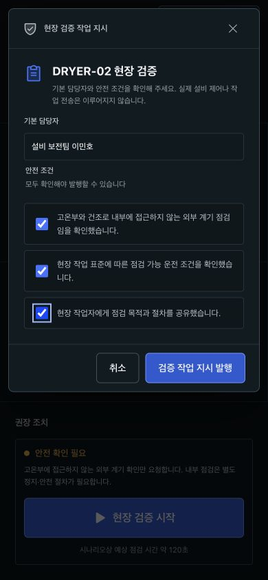
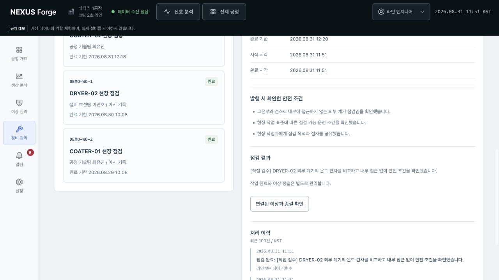
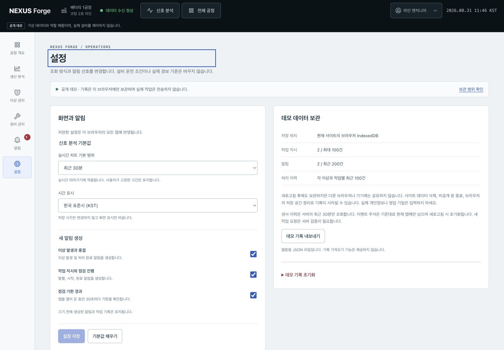

# 전 화면 직접 검수 기록 — 2026년 8월 31일

## 결론과 적용 버전

일곱 화면 유형과 두 설비의 핵심 업무 흐름을 대표 화면 크기에서 직접 확인했다. 재현한 결함 네 건은 로컬에서 수정한 뒤 같은 동작을 다시 확인했다. 작업 발행, 점검 결과 저장, 별도 이상 종결과 새로고침 복원도 두 설비 모두 완료했다.

이 문서는 **11:15~12:03 KST의 직접 검수 기록**이다. 당시 마지막 추가 뷰포트 검사에서는 내장 브라우저 URL 정책이 접근을 차단했고 일반 Tab 이동과 방향키 스크롤도 확인하지 못했다. 이후 사용자가 허용한 저장소 Playwright 검사에서 모바일 16조건과 일반 키보드 조작을 확인했다. 이 도구 중단 기록을 소급 변경하지 않으며, 후속 회귀와 공개 반영 상태는 [최종 검증 기록](./FINAL_VERIFICATION_2026-08-31.md)을 따른다.

- 직접 확인 시간: 2026년 8월 31일 약 11:15~12:00 KST. 추가 반복 검사는 약 12:03에 중단했다.
- 공개 사이트: `20ad702` 배포의 개요와 두 진단 화면을 확인하고 조치 바로가기 문제를 재현했다.
- 수정 후 확인: `20ad702` 이후 로컬 작업 트리, Vite `127.0.0.1:5173`, Node API/WS `127.0.0.1:8787`.
- 도구: 사용자가 지정한 Codex 내장 브라우저. DOM 조회, 실제 클릭과 입력, 스크롤 및 저장한 뷰포트 캡처를 함께 사용했다.
- 화면 크기: 1440×1000, 1280×720, 390×844, 320×568 중 화면별 주요 조건. 모든 화면과 크기의 조합을 시각적으로 전수 검수한 것은 아니다.
- 데이터: 공개 데모의 합성 데이터. 작업에는 `[직접 검수]`를 표시했다. 실제 담당자 전송, 설비 제어와 기존 기록 초기화는 하지 않았다.

검수 이미지 44장을 [캡처 폴더](./design/review-2026-08-31/)에 보관했다. 파일별 시각, 출처, 화면 크기와 확인 내용을 [manifest.json](./design/review-2026-08-31/manifest.json)에 기록했다. 수정 후 확인한 제품 코드 6개 파일의 SHA-256도 남겨 로컬 수정본을 식별할 수 있게 했다. 중복, 중간 위치와 로딩 화면은 대표 근거에서 제외했다. 잘못 이어 붙은 전체 페이지 캡처 대신 실제 뷰포트 크기의 이미지를 구간별로 확인했다.

## 흐름별 결과

| 단계 | 확인한 화면과 행동 | 결과 |
| --- | --- | --- |
| 1. 이상 발견 | 공정 개요의 12대 설비, 공개 데모 안내, 모바일 하단과 두 진단 진입 | 확인 완료. 클릭 가능한 진단 설비와 상태 조회 전용 설비가 구분됨 |
| 2. 신호와 근거 확인 | COATER 4개 패널, DRYER 3개 패널과 165°C 설정값, 확대/이동/따라가기, 원본 참고값, 이벤트·주석·근거 링크 | 바로가기 결함 수정 후 확인. 참고값과 이벤트의 세로 겹침 없이 하단에 도달 |
| 3. 검증 작업 발행 | 관리자 담당자 선택, 엔지니어 기본 담당자, 설비별 안전 조건, 짧은 대화상자와 취소 | 두 설비 발행 완료. 미확인 체크가 있으면 발행 차단. Tab 경계 순환, Escape 닫기와 원래 버튼 포커스 복귀 확인 |
| 4. 점검 수행 | 정비 검색과 빈 상태, 작업 시작, 짧은 결과 차단, 초안 화면 왕복, 결과와 인계 확인 | 두 작업 완료. 저장 후에 완료 상태로 전환되고 새로고침 후 결과 복원 |
| 5. 이상 종결 | 검색·심각도 필터, 이상 확인, 담당자 저장, 미완료 작업의 종결 차단, 결과 검토와 종결 사유 | 두 이상 별도 종결. 모바일 상세 이동 수정. 없는 기록 ID에는 복구 경로 제공 |
| 6. 후속 조회 | 알림 읽음과 관련 기록, 마지막 읽지 않은 알림의 빈 상태, 생산 기간·라인 필터 및 표 스크롤 | 라인별 집계 수정 후 완료 2건/종결 2건 확인. CSV는 선택 라인의 24행을 실제 내려받음 |
| 7. 설정과 복구 | 미저장 설정 왕복, 저장 후 새로고침, 기본값 복원, JSON 내보내기, 잘못된 초기화 문구, 서버 중단/복구 | 설정과 기록 복원 확인. 확인 문구가 틀리면 삭제 차단. API 복구 뒤 오류 제거 및 조회 재개 |

### 1. 공정 개요

공개 버전의 전체 공정 화면이다. 모바일은 [상단 설비 카드](./design/review-2026-08-31/35-overview-mobile.jpg)와 [최하단 조치](./design/review-2026-08-31/67-overview-mobile-final-action.jpg)를 따로 확인했다. 업무 종결이 합성 설비의 정상화를 뜻하지 않는다는 설명도 남아 있다.

### 2. 신호 진단과 근거

이 화면은 서버 복구 후의 로컬 확인이다. 원본 참고값 카드와 이벤트가 같은 영역을 덮지 않는다. [DRYER 데스크톱](./design/review-2026-08-31/06-dryer-desktop.jpg), [모바일 온도 차트](./design/review-2026-08-31/68-dryer-mobile-chart-top.jpg), [근거 접기 후 다시 이동](./design/review-2026-08-31/56-mobile-evidence-reopen.jpg), [모든 이벤트 유형 해제](./design/review-2026-08-31/57-event-empty-mobile.jpg)도 확인했다.

주석은 설비별로 표시되며 다른 설비로 이동할 때 작성 전 초안이 잘못 전달되지 않았다. 저장한 주석은 화면 이동 중 유지되지만 새로고침하면 사라지는 탭 전용 데이터다. 실제 서버를 재시작했으므로 합성 센서 시나리오의 발생 시각과 이미 저장한 업무 발생 시각이 다를 수 있다. 업무 기록의 시각은 소급 변경하지 않는다.

### 3. 설비별 안전 확인과 발행

DRYER에는 고온부와 건조로 내부에 접근하지 않는 조건을 표시했다. COATER에는 댄서 롤 안전 가드와 동선 확인을 사용한다. [미확인 체크 상태](./design/review-2026-08-31/37-coater-mobile-verification-dialog.jpg)에서는 발행 버튼이 비활성화된다. [320×568 하단 스크롤](./design/review-2026-08-31/39-short-dialog-footer-visible.jpg)로 취소와 발행 영역에 도달했고, Escape로 닫은 뒤 원래 버튼으로 포커스가 복귀했다.

| 설비 | 로컬 검수 작업 | 역할 / 담당자 | 최종 확인 |
| --- | --- | --- | --- |
| COATER-02 | `WO-6C64AC8F` | 교대 관리자 / 공정 기술팀 최유진 | 발행 → 시작 → 결과 저장 → 별도 종결 |
| DRYER-02 | `WO-12E1EA7F` | 라인 엔지니어 / 설비 보전팀 이민호 | 발행 → 시작 → 결과 저장 → 별도 종결 |

[발행 결과](./design/review-2026-08-31/40-coater-issued-mobile.jpg)에서 작업 ID와 담당자를 확인했다. 완료한 작업을 다시 열었을 때에는 [같은 ID와 완료 상태](./design/review-2026-08-31/59-completed-work-not-duplicated.jpg)를 조회했으며 새 발행 버튼은 나타나지 않았다.

### 4~5. 점검 결과, 종결과 복원

점검 전에는 [종결 폼이 비활성화](./design/review-2026-08-31/26-incidents-mobile-closure-guard.jpg)된다. 점검 결과와 종결 사유에 `짧음`을 입력하고 확인 항목을 체크해도 저장 버튼은 비활성화 상태였다. 유효한 점검 초안은 [다른 화면 왕복 후에도 유지](./design/review-2026-08-31/42-maintenance-draft-restored.jpg)됐다.

새로고침 후에도 [DRYER 종결 사유와 완료 작업 링크](./design/review-2026-08-31/50-dryer-resolution-after-reload.jpg)가 복원됐다. 없는 이상 ID는 [명시적인 빈 상태](./design/review-2026-08-31/66-missing-record-recovery.jpg)와 목록 복귀를 제공했다.

### 6. 생산 집계와 알림

코팅 2호 라인은 미종결 0건, 점검 완료 2건, 이상 종결 2건이었다. 같은 시점의 코팅 1호 라인은 세 항목 모두 0건으로, 다른 라인과 예시 이력이 섞이지 않았다. 생산 실적 자체는 작업 완료로 변경하지 않았다.

[모바일 표의 오른쪽 끝](./design/review-2026-08-31/20-production-mobile-right-columns.jpg)과 [집계 최하단](./design/review-2026-08-31/23-production-mobile-final-bottom.jpg)을 실제 스크롤로 확인했다. 알림은 관련 기록으로 이동하고, 전체 읽음 후 [빈 상태에서 필터를 초기화](./design/review-2026-08-31/54-notifications-empty-bottom.jpg)할 수 있었다.

내려받은 파일도 읽어 검사했다. `nexus-forge-production-demo.csv`는 UTF-8 BOM, 7열, 24행이며 모든 행이 선택한 `COATING-LINE-02`였다. `nexus-forge-demo-records.json`의 `scope`는 `browser-only-public-demo`였고, 예시가 아닌 두 작업 모두 `completed`, 두 이상 모두 `resolved`였다. 각 작업의 안전 확인 3개와 결과, 종결 사유도 포함됐다. 내보내기 파일은 사용자 다운로드 폴더에 남기고 저장소에는 복제하지 않았다.

### 7. 설정과 장애 복구

15분/UTC로 변경한 설정 초안이 화면 왕복 후 유지됐고, 저장 후 새로고침해도 복원됐다. 확인 후 30분/KST 기본값으로 다시 저장했다. [잘못된 초기화 문구](./design/review-2026-08-31/34-settings-small-mobile-reset-guard.jpg)로는 삭제할 수 없었다. 이번 검수에서는 실제 초기화를 실행하지 않았다.

[서버 중단 시 공정 개요](./design/review-2026-08-31/61-overview-api-failure.jpg)와 [생산 조회 오류](./design/review-2026-08-31/62-production-api-failure.jpg)를 확인했다. 서버를 다시 실행하고 재시도한 뒤 [조회 결과와 CSV 조작이 복구](./design/review-2026-08-31/63-production-recovered.jpg)됐다. 별도의 [진단 이력 오류](./design/review-2026-08-31/09-history-error-action-guard.jpg)에서는 작업 발행을 차단했고, 이력 재조회 후 정상 조작으로 복귀했다.

## 재현한 결함과 수정 근거

| 결함 | 수정 전 | 수정과 재확인 |
| --- | --- | --- |
| 진단의 `현장 검증` 링크가 조치 영역을 보여주지 않음 | [공개 화면](./design/review-2026-08-31/07-dryer-bottom-safety.jpg). hash 변경마다 우측 패널이 재생성되어 스크롤이 초기화됨 | hash를 컴포넌트 key에서 제거하고 렌더링 이후 목표 제목에 포커스/스크롤. [같은 데스크톱 크기](./design/review-2026-08-31/10-dryer-action-anchor-fixed.jpg), 모바일 및 낮은 화면에서 재확인 |
| 생산 라인 필터에서 DRYER의 업무 건수가 누락 | [미종결 1건](./design/review-2026-08-31/12-production-table-and-workflow.jpg). 라인 필터가 COATER ID 한 개만 비교 | 설비 트리의 합성 라인 접미사 규칙과 맞춰 두 설비를 포함. [미종결 2건](./design/review-2026-08-31/13-production-line-count-fixed.jpg), 완료/종결 각각 2건과 다른 라인 0건 확인 |
| 매우 작은 증감이 `-0.00%p`로 표시 | [수정 전 지표](./design/review-2026-08-31/11-production-desktop.jpg) | 0과 표시 정밀도보다 작은 증가/감소를 구분. [320px 지표](./design/review-2026-08-31/52-production-small-mobile-corrected-metrics.jpg)에서 줄바꿈 확인 |
| 모바일 목록 선택 뒤 상세 제목만 화면 맨 아래에 보임 | [수정 전 위치](./design/review-2026-08-31/25-incidents-mobile-detail.jpg) | `nearest` 대신 `start`로 제목을 스크롤. 기존 고정 헤더 여백을 유지하고 [상세와 후속 조작 노출](./design/review-2026-08-31/31-mobile-record-selection-fixed.jpg) 확인 |

진단 이동은 API 로딩 이후에도 동작하고 실시간 데이터 갱신마다 포커스를 다시 가져가지 않도록 했다. 근거를 접은 후 다른 영역을 거쳐 다시 근거로 이동하면 전체 근거를 펼친다. 변경 범위를 재마운트, 포커스 이동과 집계 함수에 한정했으며 화면 구조나 시계열 샘플러는 바꾸지 않았다.

## 당시 자동 검사와 후속 확인

다음 표와 중단 사유는 직접 검수 종료 당시의 기록이다. 이후 실행한 검사를 중복 합산하거나 이전 실행의 성공으로 바꾸지 않는다.

| 구분 | 이번 실행 결과 |
| --- | --- |
| 웹 단위/컴포넌트 | 19개 파일, 98개 통과. 진단 앵커 6개, 상세 포커스 2개, 집계/증감 2개, 근거 재진입 1개 추가 |
| 서버 단위 | 3개 파일, 14개 직접 재실행 통과 |
| 정적 검사 | 루트 lint, 전체 TypeScript 및 Vercel API 타입 검사 통과 |
| 산출물 | 앱/서버/공유 패키지 빌드, Storybook 빌드, Sites 호환성 4개 통과 |
| 기존 E2E | `20ad702`의 53개 성공 기록 유지. 이번 수정 이후 재실행 결과로 사용하지 않음 |
| 추가 DOM 너비 검사 | 320×568의 8개 화면과 390×844의 6개 화면에서 로딩 완료 후 문서 가로 넘침 없음. 초기 뷰포트의 숨김 텍스트 검사도 발견 0건 |
| 문서 정합성 | Markdown 16개, 로컬 링크 179개와 제목 앵커 5개 검사. 깨진 연결 없음. 캡처 44개의 JPEG 형식과 목록 일치, 수정 코드 6개의 해시 일치 확인 |

첫 자동 실행에서는 새 테스트가 JSDOM에 없는 `scrollIntoView`를 사용해 처리되지 않은 예외 2건이 발생했다. 해당 테스트에 스크롤 호출 대역을 설정한 후 전체를 재실행해 98개와 예외 0건으로 통과했다. 제품 코드를 예외가 나지 않도록 약화하지 않았다. Storybook의 개발 문서용 큰 청크 경고와 페이지 종료 과정의 Vite 프록시 `EPIPE`/`ECONNRESET`은 남아 있다.

직접 검수 종료 시점에 남았던 세 항목과 이후 확인 방법은 다음과 같다.

1. **추가 뷰포트 반복 검사:** 당시 390×844의 알림/설정 두 조건은 로딩 중에 접근이 중단됐다. 이후 Playwright에서 로딩 완료를 기다려 16조건 전체를 통과했고 알림/설정의 상단과 하단 캡처를 추가 확인했다.
2. **일반 키보드 탐색:** 내장 브라우저에서는 일반 Tab 이동과 방향키 스크롤이 나타나지 않았다. 이후 Playwright의 실제 Tab, Shift+Tab, Enter와 ArrowDown 검사로 포커스와 스크롤 이동을 확인했다. 내장 브라우저 도구의 동작 원인을 확정한 것은 아니다.
3. **전체 E2E 및 공개 반영:** 이 직접 검수 시점에는 미실행이었다. 이후 별도 승인된 회귀 검사와 공개 배포 결과는 [후속 완료 기록](./FINAL_VERIFICATION_2026-08-31.md)에 기록한다. 내장 브라우저의 차단을 우회한 캡처로 대체하지 않았다.

Safari/Firefox, 실제 브라우저 확대와 화면 낭독기, 실기기 터치, 현장 네트워크와 실제 제조 데이터, 다중 사용자 승인 및 장시간 운영은 별도의 범위다. 이번 검수 완료 항목이나 스크린샷만으로 전체 접근성 준수와 무결함을 보증하지 않는다.
