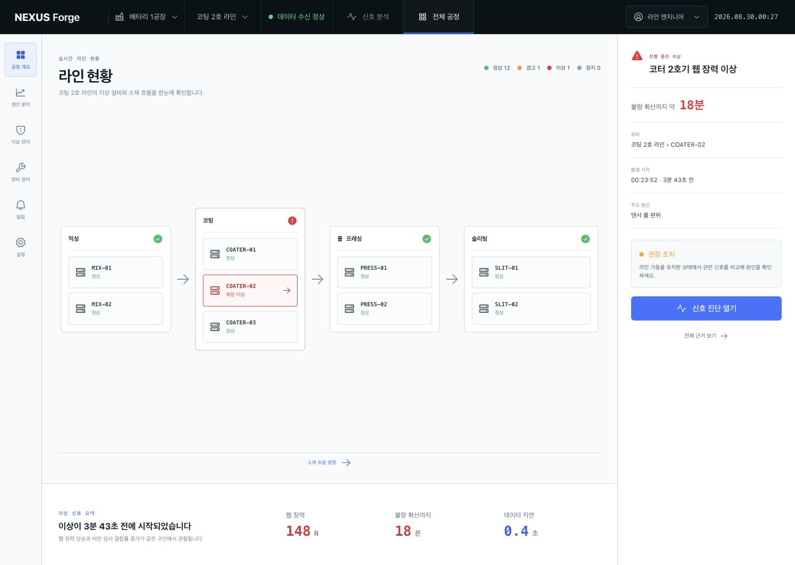
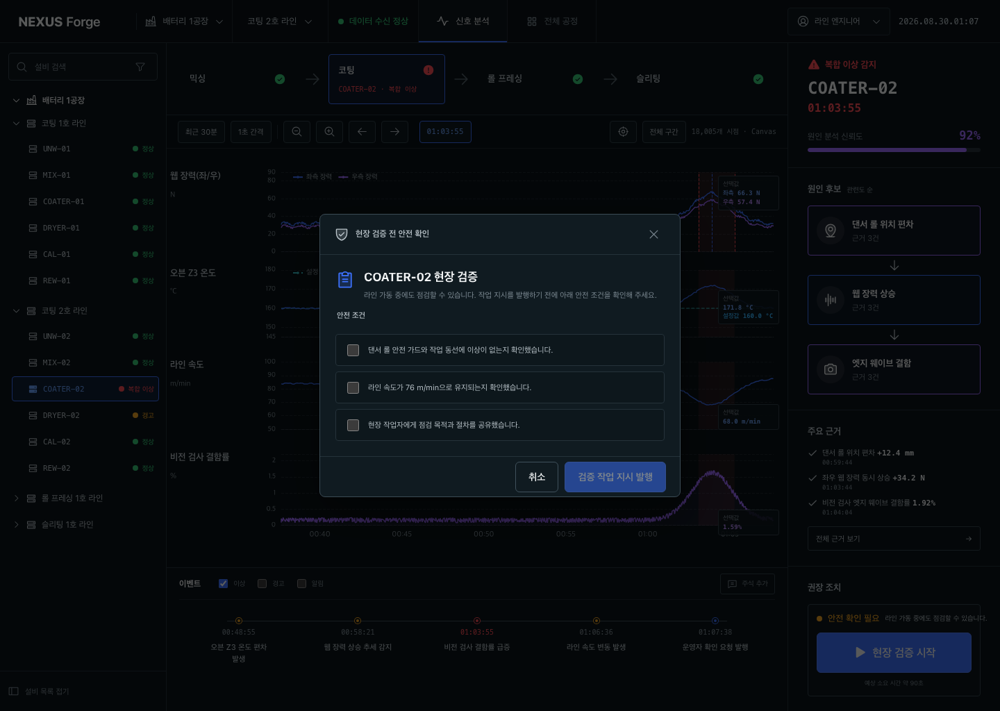
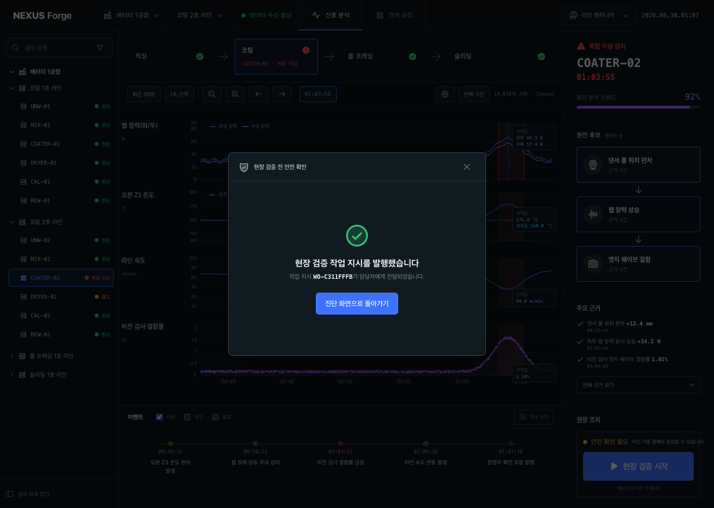
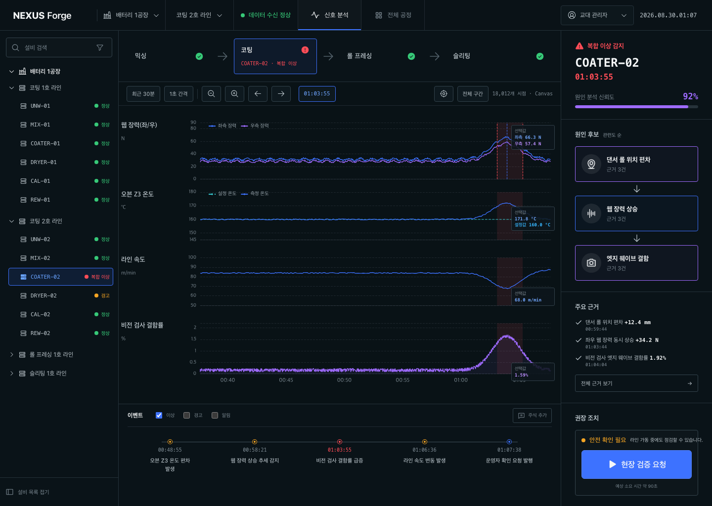

# 화면 문구 검토 기록

## 검토 범위

공정 개요에서 이상 설비를 찾고, 신호를 분석한 뒤 현장 검증 작업 지시를 발행하는 전체 흐름을 검토했습니다. 화면에 노출되는 제목, 상태, 센서명, 이벤트, 도움말, 버튼, 오류 메시지와 접근성 이름을 포함했습니다.

## 사용자 목표

라인 엔지니어와 교대 관리자가 제조 현장 용어를 별도로 해석하지 않고도 현재 상태와 다음 행동을 빠르게 이해하는 것이 목표입니다.

## 용어 기준

[LG에너지솔루션 배터리 제조 공정 자료](https://inside.lgensol.com/2022/04/%EC%A0%84%EC%A7%80%EC%A0%84%EB%8A%A5%ED%95%9C-%EC%A0%84%EC%A7%80-%EC%9D%B4%EC%95%BC%EA%B8%B0-%EB%B0%B0%ED%84%B0%EB%A6%AC-%EB%A7%8C%EB%93%A4%EA%B8%B0-step1-%EC%A0%84%EA%B7%B9-%EA%B3%B5/)에서 사용하는 믹싱, 코팅, 롤 프레싱, 슬리팅 표기를 기준으로 공정명을 통일했습니다.

## 주요 개선

| 구분 | 변경 전 | 변경 후 | 이유 |
| --- | --- | --- | --- |
| 선택 시점 값 | 현재값 | 선택값 | 이상 발생 시점을 가리키는 값이므로 의미를 바로잡음 |
| 공정명 | MIXING, PRESSING | 믹싱, 롤 프레싱 | 공식 제조 공정 용어와 한국어 UI를 일치시킴 |
| 라인명 | 코팅 라인 2 | 코팅 2호 라인 | 국내 제조 현장의 호기 표기 방식에 맞춤 |
| 설비 탐색 | 장비 검색, 설비 트리 | 설비 검색, 설비 목록 | 동일 개념의 용어를 통일하고 개발 용어를 줄임 |
| 차트 제어 | 샘플링 1초, 자동 스케일 | 1초 간격, 전체 구간 | 버튼을 눌렀을 때 일어나는 결과를 쉽게 설명 |
| 원인 정보 | 상관 신뢰도, 가능 원인 상위 | 원인 분석 신뢰도, 원인 후보 | 통계 용어보다 현장 판단 목적을 분명히 전달 |
| 근거 개수 | 근거 3개 | 근거 3건 | 업무 기록에 맞는 단위를 사용 |
| 권장 조치 | 라인 가동 유지 상태에서 수행 가능 | 라인 가동 중에도 점검할 수 있습니다 | 명사를 나열한 표현을 완전한 문장으로 변경 |
| 현장 절차 | 현장 확인 요청 | 검증 작업 지시 발행 | 실제 생성되는 업무 객체와 버튼 행동을 일치시킴 |
| 오류 안내 | 스트림 서버 연결 확인 | 잠시 후 다시 시도 | 내부 시스템 구조 대신 사용자가 할 수 있는 행동을 안내 |

## 흐름별 결과

### 1. 공정 개요 — 양호

공정명, 라인명, 이상 영향 시간과 권장 조치를 자연스러운 한국어로 정리했습니다. 하드코딩된 “4분 전”을 실제 발생 경과 시간으로 교체했습니다.

### 2. 신호 진단 — 양호

센서명, 차트 제어, 선택 시점 값, 이벤트명, 원인 후보와 근거 단위를 통일했습니다. 긴 문구가 세 영역 레이아웃에서 잘리거나 겹치지 않는 것을 확인했습니다.

### 3. 안전 조건 확인 — 양호

모달의 목적을 “원인 검증”에서 “현장 검증”으로 구체화하고, 각 체크 항목이 무엇을 확인했는지 완전한 문장으로 작성했습니다.

### 4. 작업 지시 완료 — 양호

“요청이 발행되었습니다”를 “작업 지시를 발행했습니다”로 바꿔 주체와 결과를 분명하게 표현했습니다.

### 5. 교대 관리자 행동 — 양호

역할별 버튼을 라인 엔지니어의 “현장 검증 시작”과 교대 관리자의 “현장 검증 요청”으로 구분했습니다. 두 문구 모두 한 줄로 표시됩니다.

## 접근성 확인

- 검색창과 필터의 접근성 이름을 화면 용어와 같은 “설비”로 통일했습니다.
- 차트 설명에 비교 대상과 같은 시간축이라는 의미를 포함했습니다.
- 과거 선택 시점의 값을 보조 기술에서도 “현재값”으로 오해하지 않도록 이름을 수정했습니다.
- 역할별 버튼의 접근성 이름과 보이는 문구가 일치하는 것을 DOM에서 확인했습니다.

스크린샷과 DOM으로 문구, 읽기 순서, 잘림 여부를 확인했습니다. 실제 스크린 리더의 한국어 발음 품질과 현장 소음 환경에서의 인지성은 별도의 사용성 시험이 필요합니다.
